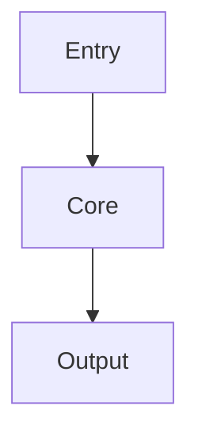

# Package Name

## Overview
Briefly describe the package's purpose and core capabilities.

## Quick Start
```js
import { Something } from 'package-name';

// basic usage
```

## Key APIs
- `method_one(opts)` – short description
- `method_two(opts)` – short description

## Usage Example
```js
// demonstrate realistic flow
```

## Architecture


## Further Reading
- [Spec](./spec.md)
- [Tests](./test)
- [API Docs](./docs)
