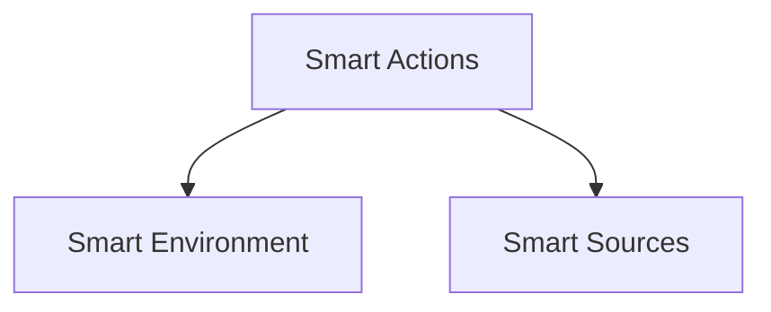

# Smart Actions

High-level collection for managing smart actions in the Smart Connect desktop app.

## Smart Action

A smart action is a reusable, modular piece of functionality that can be executed within the Smart Connect environment. It can be defined in various formats, such as ES modules or CommonJS modules, and can also interact with remote APIs.
## Architecture

Actions operate against sources with awareness of the active environment.
