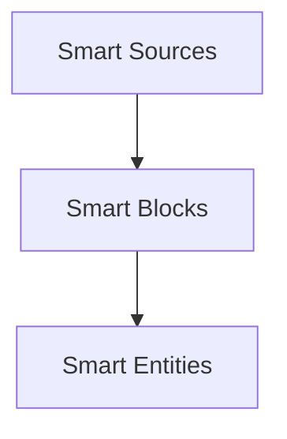

# SmartBlocks

## Purpose and Role
- **SmartBlocks** handle discrete segments of content within a **SmartSource**, such as headings, paragraphs, or code blocks.
- They unify logic for reading, updating, and removing block-level content, integrating closely with file-based adapters and embedding frameworks.

## Key Classes and Concepts
**SmartBlocks** reside below **SmartSources** (dependent) and **SmartEntities** (extends) in the hierarchy, acting as fine-grained content units within a single source.

### SmartBlock
- **Description**: Represents a single content block within a SmartSource.
- **Extends**: `SmartEntity` – inherits embedding and semantic capabilities.
- **Responsibilities**:
	- Store block-level metadata (line numbers, hashing for detect changes).
	- Embed and re-embed content as needed.
	- Provide CRUD operations at the block level (read/update/remove content).
	- Move blocks between sources or merge content from external blocks.

### SmartBlocks (Collection Class)
- **Description**: Manages a collection of `SmartBlock` instances for a given set of sources.
- **Extends**: `SmartEntities` – inherits indexing, searching, and embedding batch operations.
- **Responsibilities**:
	- Import and export all blocks for a given SmartSource during source import.
	- Handle block-level re-parsing after file edits.
	- Maintain references and ensure synchronization with the parent SmartSource.
	- Queue blocks for embedding, saving, or loading.
	
### Block Adapters
- **MarkdownBlockContentAdapter** (example):
	- Integrates with markdown parsing (`markdown_to_blocks.js`).
	- Finds and manipulates lines that represent a block in a `.md` file.
	- Provides `block_read`, `block_update`, `block_remove`, and `block_move_to` methods.
- **_adapter.js**:
	- Abstracts block-level CRUD operations.
	- Other potential adapters could extend from this for different file formats or environments.

## Lifecycle and Operations
1. **Importing Blocks**:  
	 When a SmartSource is imported, its file content is parsed into an array of blocks. Each block is represented as a SmartBlock item added to the SmartBlocks collection.
	 
2. **Reading and Updating**:
	 - **Read**: Retrieve the block's textual content from the source file using a block adapter.
	 - **Update**: Overwrite the block’s content lines and persist changes back to the file system. Re-parse if needed.
	 
3. **Removing and Moving**:
	 - **Remove**: Delete the block content from the source file. Reflect changes in the SmartBlocks collection.
	 - **Move**: Extract a block and append it to another source, possibly changing its file location and line references.
	 
4. **Embedding**:
	 - SmartBlocks leverage `SmartEntity` to store embeddings for semantic search.
	 - After content or structure changes, blocks may be queued for re-embedding.
	 - Embed operations can occur in batches, improving performance.

5. **Searching and Semantics**:
	 - With embeddings, SmartBlocks can be searched semantically (nearest-neighbor or keyword lookups).
	 - Individual blocks, rather than entire files, can be surfaced when queries match their content.

## Integration Points
- **SmartSource**:
	- SmartBlocks are always associated with a parent SmartSource.
	- Source-level operations (like `merge` or `update`) cascade to block-level changes.

- **smart-embed-model/**:
	- SmartBlocks use embedding models to produce vectors, enabling semantic queries at a granular level (paragraph, heading, snippet).

- **smart-change/** (if integrated):
	- Changes to blocks can be wrapped with "before" and "after" hooks, logging or formatting changes in user-friendly ways.

## Use Cases
- **Fine-Grained Content Editing**:  
	Update a single heading or paragraph in a large document without reprocessing the entire file.
	
- **Semantic Lookups**:  
	Quickly find the most relevant block for a query (e.g., “Definition of X” returns the exact block containing that definition).
	
- **Refactoring Content**:  
	Move a block from one document to another source file, preserving references and embeddings.

## Extensibility
- **Additional Adapters**:  
	Beyond markdown, developers can write custom adapters to handle other file formats (HTML, JSON-based notes, etc.).
## Architecture

Blocks slice sources into entity-backed segments for fine-grained operations.
