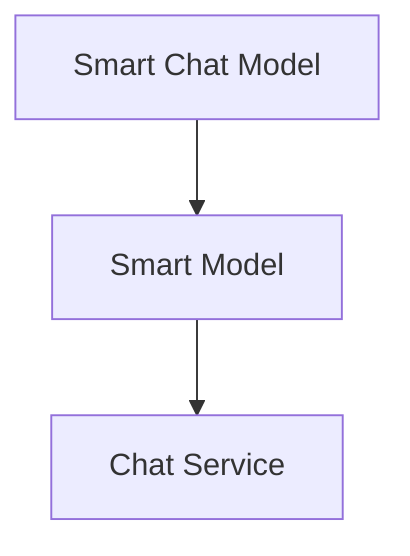

# Smart Chat Model

A universal chat model API client that supports a wide variety of providers and models. 

Supports using OpenAI formatted requests for any provider.

## Important Nomenclature

### `defaults` -> `settings` -> `opts` -> `config`

- `defaults` are default values (static)
- `settings` are persisted values (dynamic)
- `opts` are passed to the model class constructor
- `config` contains the above values merged such that `opts` override `settings` and `settings` override `defaults`

`config` type getters should be the preferred way to access values.

### `adapter` vs `model`

- `adapter` refers to the adapter class
- `model` refers to the specific model used by the adapter

## Adapter Pattern

The library uses the adapter pattern to normalize different LLM APIs into a consistent interface:

### Core Components

- `SmartChatModelAdapter`: Base adapter class that defines the common interface
- `SmartChatModelApiAdapter`: Base class for HTTP API-based adapters
- Provider-specific adapters (e.g. `AnthropicAdapter`, `CohereAdapter`) that handle the details of each API

### Request/Response Flow

1. Input: OpenAI-formatted request
2. Adapter converts to provider's format
3. Makes API call
4. Converts response back to OpenAI format
5. Output: Normalized OpenAI-style response

### Configuration Flow

`defaults` -> `settings` -> `opts` -> `config`

- `defaults`: Static default values defined in adapter classes
- `settings`: Persisted user settings (API keys etc.)
- `opts`: Runtime options passed to constructor
- `config`: Merged configuration (opts override settings override defaults)

### Key Concepts

- `adapter`: The adapter class that handles provider-specific logic (frequently platform-specific)
- `model`: The specific model being used via the adapter

## Usage Example

```javascript
const chatModel = new SmartChatModel({
	platform_key: 'anthropic', // Select provider
	adapters: {
		anthropic: AnthropicAdapter
	},
	settings: {
		anthropic: {
			api_key: 'your-api-key',
			model_key: 'claude-3-opus-20240229'
		}
	}
});

// Use OpenAI format regardless of provider
const response = await chatModel.complete({
	messages: [
		{ role: 'user', content: 'Hello!' }
	]
});
```
## Architecture

The chat model wraps the base model with dialogue-specific helpers that call external chat services.
