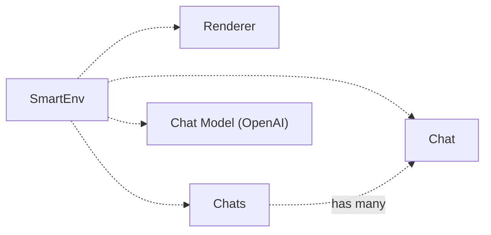

# Smart Chats
Used to build [Smart Connections](https://github.com/brianpetro/obsidian-smart-connections).

### Notes

- `SmartEnv` is the orchestrator and loads mixin classes
- `SmartChats` is used to manage chat history
- `SmartChat` is a chat instance
- `SmartUI` is used to render the chat UI

### Minimal Dependencies

One of the key advantages of `SmartChat` is its minimal dependency requirement. This makes it an ideal choice for developers looking to integrate chat functionalities without the overhead of managing numerous dependencies. By focusing on a lean architecture, `SmartChat` ensures that your application remains lightweight and easy to maintain.

### Building Your Own App

`SmartChat` is designed to be highly customizable, enabling developers to build their own applications that leverage its chat functionalities.
