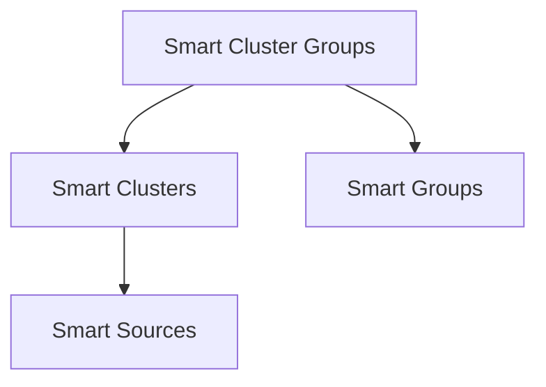

# smart-cluster-groups

Provides higher-level "group of clusters" logic on top of [smart-clusters](../smart-clusters) and [smart-collections](https://github.com/brianpetro/jsbrains/tree/main/smart-collections). A `ClusterGroup` manages multiple clusters together, along with group-wide or per-cluster filter data, snapshots, and the ability to clone groups.

## Overview

A "cluster group" is a collection item (`ClusterGroup`) that references multiple `Cluster` items by key. This allows you to define an overarching group of clusters, keep track of shared filters, and produce snapshots that calculate similarity scores for each item against every cluster in the group.

## Usage

### 1. Import `ClusterGroup` and `ClusterGroups`

```js
import { ClusterGroup, ClusterGroups } from 'smart-cluster-groups';
````

### 2. Register in the Environment

Similar to other collections:

```js
env.item_types.ClusterGroup = ClusterGroup;
env.collections.cluster_groups = new ClusterGroups(env, {
	collection_key: 'cluster_groups'
});
```

### 3. Creating a New Cluster Group

You can directly invoke `create_or_update`:

```js
// Suppose you have some existing clusters
const c1 = env.clusters.get('hash1234');
const c2 = env.clusters.get('hash5678');

const new_group = env.cluster_groups.create_or_update({
	data: {
		clusters: {
			[c1.key]: { filters: {} },
			[c2.key]: { filters: {} }
		},
		filters: { some_global_filter: true }
	}
});
```

### 4. Retrieving a Snapshot

A cluster group can compute a "snapshot" across all clusters for a given set of items (or all items in `smart_sources` if none is provided):

```js
const snapshot = await new_group.get_snapshot(/* optional array of items */);
console.log(snapshot.members);
/*
{
	clusters: [ ... ],
	members: [
		{
			item: <ref>,
			clusters: {
				[cluster.key]: { score },
				...
			}
		}
	],
	filters: { ...group-level filters }
}
*/
```

### 5. Cloning a Group with Modified Clusters

Cluster groups are commonly "cloned" when you want to add or remove certain clusters without mutating the original group:

```js
const cloned_group = await new_group.clone({
	remove_clusters: ['hash5678'],
	add_clusters: ['hash9999']
});
```

This returns a brand-new `ClusterGroup` item referencing the new set of clusters.

### 6. Convenience Method: `create_group([...center_keys])`

`ClusterGroups` includes a helper called `create_group` which quickly:

- Creates new `Cluster` items for each `center_key`.
- Bundles them into a new `ClusterGroup`.

```js
// Example:
await env.cluster_groups.create_group(['alpha_key', 'beta_key']);
```

This is helpful when you have a list of center_keys and want a brand-new group quickly.

## Key Classes

### `ClusterGroup`

Extends `CollectionItem`. Stores:

- `data.key`: Defaulted to timestamp at creation.
- `data.clusters`: Object keyed by cluster keys, each with optional `filters`.
- `data.filters`: Additional group-wide filters or settings.

**Methods**:

- `get_snapshot(items)`: Returns an object containing each item and its similarity scores per cluster.
- `clone(opts)`: Creates a new `ClusterGroup` with some clusters removed and/or added.
- `add_cluster(cluster)`, `add_clusters(clusters)`: Adds one or multiple clusters to the group.
- `remove_cluster(cluster)`, `remove_clusters(clusters)`: Removes one or multiple clusters from the group.

### `ClusterGroups`

Extends `Collection`. Manages multiple `ClusterGroup` items. Basic usage:

- `create_or_update({ clusters: {...} })`
- `delete_many([...])`
- `filter(...)`
- `create_group([...center_keys])` (example convenience method)
- `add_clusters(clusters)`, `add_cluster(cluster)`
- `remove_clusters(clusters)`, `remove_cluster(cluster)`

## Example Flow

1. **Create or Fetch Clusters** in `smart-clusters`:
		
		```js
		const cluster_a = env.clusters.create_or_update({ data: { center: { 'item_a': { weight: 1 } } } });
		const cluster_b = env.clusters.create_or_update({ data: { center: { 'item_b': { weight: 2 } } } });
		```
		
2. **Create a Cluster Group** referencing these clusters:
		
		```js
		const group = env.cluster_groups.create_or_update({
			data: {
				clusters: {
					[cluster_a.key]: { filters: {} },
					[cluster_b.key]: { filters: {} }
				},
				filters: { some_global_filter: true }
			}
		});
		```
		
3. **Retrieve a Snapshot** to see how items score against each cluster:
		
		```js
		const snapshot = await group.get_snapshot();
		console.log(snapshot.members);
		```
		
4. **Clone the Group** when you want to add or remove clusters without overwriting the existing group:
		
		```js
		const new_group = await group.clone({
			add_clusters: ['cluster_c_key'],
			remove_clusters: ['cluster_a_key']
		});
		```
		

## Architecture

Cluster groups combine clustering and grouping layers to organize sources.
