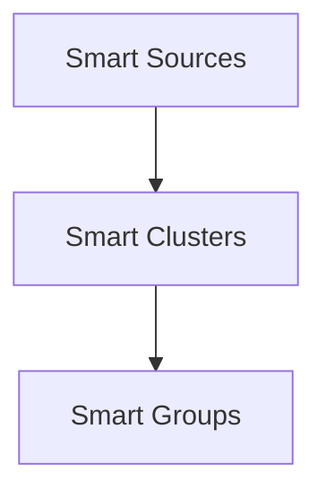

# smart-clusters

Provides utilities for creating and managing clusters of items (e.g., embeddings or other vector-based items). It extends the [smart-collections](https://github.com/brianpetro/jsbrains/tree/main/smart-collections) module by adding `Cluster` items (single logical clusters) and a `Clusters` collection.

## Overview

A "cluster" is a group of items based around one or more center vectors. Each cluster can keep track of:

- `center`: An object mapping item keys (or special entries like `[text]`) to weights (and optionally a stored vector).
- `center_vec`: A cached centroid vector derived from center items.
- `members`: Items that belong (or formerly belonged) to this cluster, along with feedback state (-1, 0, or 1).

Clusters are stored in the `Clusters` collection. Each `Cluster` is a subclass of `CollectionItem` from `smart-collections` and supports typical item-level operations: load, save, filter, and so forth. This library focuses on specialized cluster logic (e.g., computing centroids, membership states, sim-hash for a stable key).

## Installation

- Requires `smart-collections` (and any of its dependencies).
- Typically also used with `smart-entities` (for `cos_sim` and vector-based items).

## Usage

### 1. Import the Module

```js
import { Cluster, Clusters } from 'smart-clusters';
```

### 2. Register Item Types in Your Environment

```js
env.item_types.Cluster = Cluster;
env.collections.clusters = new Clusters(env, {
	collection_key: 'clusters'
});
```

Or if your environment dynamically loads modules, ensure `Cluster` and `Clusters` are registered under the appropriate `env.item_types` and `env.collections` keys.

### 3. Creating or Retrieving Clusters

```js
// Create a new cluster with an initial center
const new_cluster = await env.clusters.create_or_update({
	data: {
		center: {
			'some_item_key.md': { weight: 1 }
		}
	}
});

// Retrieve an existing cluster
const existing = env.clusters.get('abc123');
```

### 4. Adding and Removing Members

```js
// Suppose we have a vector-based item called 'item'
new_cluster.add_member(item);

// To add multiple members:
new_cluster.add_members([item1, item2, item3]);

// If we want to remove a single member:
new_cluster.remove_member(item);

// To remove multiple members:
new_cluster.remove_members([item1, item2]);ber(item);
```

### 5. Multi-center Operations

`Cluster` supports adding or removing multiple center items, then returning a new cloned cluster (and updated cluster-group, if used in conjunction with `smart-cluster-groups`):

```js
// Add a new center:
const { new_cluster, new_cluster_group } = await existing.add_center(another_item);
```

## Key Classes

### `Cluster`

Extends `CollectionItem`. Represents a single cluster.

- **Key Properties**
		- `data.center`: Object keyed by center item keys, each value like `{ weight: number }`.
		- `data.center_vec`: Cached centroid.
		- `data.members`: Tracks membership states for each item.
		- `data.sim_key`: Stores the stable sim-hash key after the first calculation.
- **Methods**
		- `get_key()`: Returns a 32-bit sim-hash of the centroid vector.
		- `add_member(item)`: Adds an item to the cluster.
		- `add_members(items)`: Adds multiple items to the cluster.
		- `remove_member(item)`: Removes an item from the cluster.
		- `remove_members(items)`: Removes multiple items from the cluster.
		- `add_center(item)`, `add_centers(items)`: Clones to a new cluster with additional center(s).
		- `remove_center(item)`, `remove_centers(items)`: Clones to a new cluster without certain center(s).

### `Clusters`

Extends `Collection`. Manages a set of `Cluster` items.
## Architecture

Clusters group similar sources before handing them to higher-level groupings.
