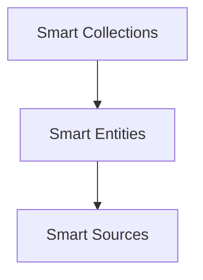

# Smart Collections

The **Smart Collections** module provides a structured yet flexible architecture for managing collections of items that need to be loaded, saved, filtered, and updated over time. This architecture is designed to handle both small and large sets of items, support asynchronous operations (e.g. lazy loading and batch saving), and offer a pluggable data storage interface (e.g. append-only JSON logs, databases, or custom backends).

## Overview

The architecture is composed of three core layers:

1. **Collection & Item Classes**:  
	 High-level abstractions representing a group of items (`Collection`) and individual entries (`CollectionItem`).

2. **Data Adapters**:  
	 Classes responsible for handling all reading, writing, and deletion of item data to and from the underlying storage. These are split into:
	 - **CollectionDataAdapter**: Orchestrates batch operations across all items in a collection.
	 - **ItemDataAdapter**: Manages the persistence of a single item’s data.

3. **Environment and Utilities**:  
	 Supporting objects, such as `env` (environment configurations), filesystem interfaces, filtering helpers, and UI components for settings.

This architecture cleanly separates concerns:  
- The `Collection` and `CollectionItem` classes define behavior and logic at an abstract level.  
- The adapters handle the specifics of I/O, data formats, and file management.  
- The environment provides runtime context, configuration, and external service integrations (like filesystem operations or rendering views).

## Core Concepts

### Collection

A `Collection` is a container that manages a set of `CollectionItem` instances. Each `Collection` instance:

- Tracks items in a keyed structure (`this.items`), allowing fast get/set operations by key.
- Supports create/update/delete operations on items.
- Filters items based on a variety of criteria (prefixes, substrings, exclusions).
- Handles batching and queue operations for loading and saving (e.g., `process_load_queue()` and `process_save_queue()`).
- Delegates to a `CollectionDataAdapter` for all low-level data operations.
- Integrates seamlessly with an `env` object, which contains configurations, filesystem interfaces, settings, and references to all registered collections.

### CollectionItem

A `CollectionItem` represents a single entry within a collection. Each item:

- Holds `data` representing its state.
- Has a unique `key` that identifies it within its collection.
- Can be loaded, saved, and deleted.
- May validate itself before saving to ensure data integrity.
- Can be filtered and processed by the collection.
- Allows asynchronous initialization, making it possible to run setup logic that relies on I/O before considering the item fully ready.

In addition, items are encouraged to keep logic for parsing and normalizing their data within their own classes. This ensures that collections remain flexible, supporting different item types (e.g., notes, sources, directories) with minimal changes.

### Data Adapters

**Data Adapters** abstract away persistence details. They are the “brains” behind how items are physically stored and retrieved. The architecture provides two layers of adapters:

1. **CollectionDataAdapter**:  
	 A class responsible for handling collection-wide operations—like loading/saving all items, processing queued operations in batches, and delegating per-item operations to the `ItemDataAdapter`.
	 
	 - It defines methods like `load_item(key)`, `save_item(key)`, and `delete_item(key)`.
	 - It also exposes `process_load_queue()` and `process_save_queue()` to batch-process items that have been flagged for loading or saving.
	 - Subclasses of `CollectionDataAdapter` can implement various storage strategies:
		 - Filesystem-based (like `.ajson` files)
		 - Database-driven (like SQLite)
		 - Custom network storage

2. **ItemDataAdapter**:  
	 Handles I/O for a single item. It is instantiated by the `CollectionDataAdapter` as needed. This class:
	 
	 - Defines `load()` to read the item’s state from storage and update `item.data`.
	 - Defines `save()` to persist the current item’s state.
	 - Defines `delete()` to mark the item as deleted in storage, removing it from persistent state.
	 - May support incremental loading (like append-only logs) and rewriting minimal forms to keep storage efficient.

By splitting the adapter logic, the architecture allows easy switching of storage backends without changing collection logic. For instance, moving from a single-file JSON strategy to an append-only JSON log or even a database only involves writing new adapter classes and updating the environment’s configuration.

### Filesystem Integration

Filesystem operations are abstracted behind `this.fs` references within adapters. The `env` object provides a `data_fs` interface that supports methods like `read()`, `write()`, `append()`, `remove()`, and `stat()`. This design allows:

- Transparent switching between different filesystem backends (e.g., a local disk, an in-memory mock for testing, or a cloud-based storage API).
- Consistent error handling and logging for I/O operations.

### Settings and UI Components

Collections often have configurable settings. The architecture allows each collection to define its `settings_config` and `default_settings`. The `settings.js` component shows how settings are rendered, leveraging a `render()` function that processes `settings_config`, creates HTML, and attaches interactive controls (like dropdowns, toggles, or text inputs).

### Queues and Batch Operations

A key optimization in large collections is the ability to queue load and save operations rather than performing them synchronously on every item update. Items flag themselves with `_queue_load` or `_queue_save` properties when they need to be loaded or saved. The collection’s adapter then processes these flags in batches:

- **Load Queue**: When triggered, the adapter loads items in batches, improving performance and avoiding blocking UI or main threads.
- **Save Queue**: When changes accumulate, the adapter batches save operations. This can significantly reduce file I/O if many items change in a short period.

### Backwards Compatibility and Legacy Formats

The architecture includes logic for rewriting legacy AJSON keys and handling historical formats. This ensures that migrating older data into the new storage format is seamless and does not break existing references.

### Testing

Integration tests (like `collection.test.js`) verify that:

- Creating, updating, and deleting items works as expected.
- Filtering and listing items behaves correctly.
- Queued operations are processed properly.
- The adapter integration behaves consistently.

By writing tests at the collection and adapter levels, we ensure that refactoring or changing the underlying storage is safe and maintainable.

## Example: AJSON Multi-File Adapter

The `AjsonMultiFileCollectionDataAdapter` and `AjsonMultiFileItemDataAdapter` illustrate a sophisticated append-only JSON log approach:

- **AJSON Format**:
	- Each `.ajson` file is essentially a transaction log: one line per state update or deletion.
	- On load, the adapter reads all lines and determines the final item state.
	- On save, the adapter appends a single line representing the new state or a `null` for deletion.
	- Periodically, it rewrites files to a minimal form, keeping just the latest state.

This approach is particularly powerful for use cases where items may be frequently updated, and we want a historical log of changes. It also makes it straightforward to revert to older states or debug issues by looking at the append-only history.

## Extending the Architecture

The Smart Collections architecture is designed to be extensible:

- **Custom Item Types**:  
	Define a new subclass of `CollectionItem` with custom logic, validation, parsing, and additional methods. Register it with `env.item_types` so the `Collection` can find it.

- **New Collections**:  
	Extend `Collection` to provide specialized filtering logic, default settings, or custom initialization routines.

- **Alternate Storage Backends**:  
	Write new adapters implementing the `CollectionDataAdapter` and `ItemDataAdapter` interfaces. For example:
	- A `SqliteCollectionDataAdapter` that stores items in a SQLite database.
	- A `MemoryCollectionDataAdapter` for testing or ephemeral data.
	- A `RemoteApiCollectionDataAdapter` that communicates with a server over HTTP.

- **UI and Settings**:  
	Add new components for settings or integrate with an application’s existing UI framework. The architecture’s reliance on environment and pluggable rendering functions means it can adapt to diverse UI frameworks.

## Conclusion

The Smart Collections architecture provides a robust, modular, and scalable foundation for managing complex sets of items in dynamic applications. Its layered approach—with clear separation of collection logic, item logic, and data persistence—enables effortless adaptability, testing, and maintenance.
## Architecture

Collections manage sets of entities derived from underlying sources.
