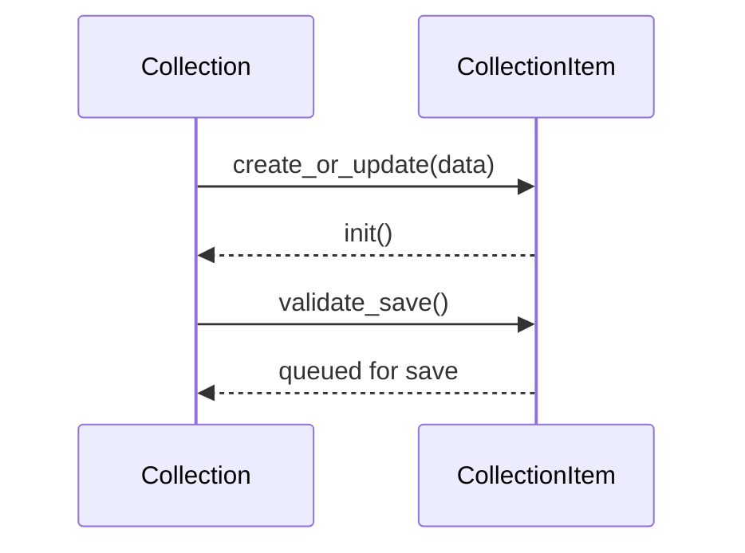

# smart-collections Specification

Exports from `main.js`:

| Export | Description |
| --- | --- |
| `Collection` | Base class managing a keyed set of items with filtering and save/load queues. |
| `CollectionItem` | Base item with lifecycle hooks and validation. |

## Key Methods (Collection)

| Method | Notes |
| --- | --- |
| `create_or_update(data)` | Add or modify an item and run its `init` if defined. |
| `filter(opts)` | Return items matching filter options or predicate. |
| `list(opts)` | Alias for `filter`. |
| `update_many(keys, data)` | Batch update items. |
| `process_load_queue()` | Delegates to the data adapter. |
| `process_save_queue()` | Delegates to the data adapter. |

## Item Lifecycle

## Item Actions

Collection items expose actions that are defined in their default configuration
exports. Each action is bound to the item instance and can be accessed via the
`actions` getter. Actions are loaded from
`env.config.collections[collection_key].items[item_type_key].actions` and this
mechanism replaces the deprecated `item_types` and `items` configuration keys.
