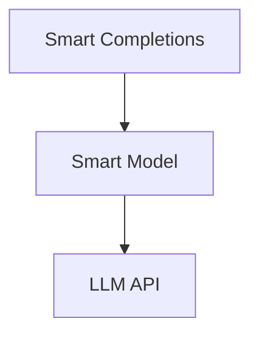

# Smart Completions

Smart Completions is a **smart-collections**-based module for managing completion requests/responses in a structured way. Each completion is a **SmartCompletion** item that can run one or more request adapters to transform or enrich the data before sending it to a chat model. Responses are then stored, making it easy to track history or retrieve final output.

## Key Components

- **SmartCompletions**  
		A collection (extending `Collection` from `smart-collections`) that manages multiple completion items.
		
		- Exposes a shared `chat_model` (if configured) for all items.
		- Provides `completion_adapters` to transform item data prior to sending a request.
- **SmartCompletion**  
		A single completion item (extending `CollectionItem`), storing:
		
		- `completion.request`: Data in a chat-model-friendly format (e.g. OpenAI-like messages).
		- `completion.responses[]`: The returned data from the model.
		- `completion.chat_model`: (Optional) An override specifying a dedicated model instance.
		- Adapters can modify the request or the response.
- **Adapters** (in `adapters/`)  
		Small classes extending `SmartCompletionAdapter`. Each checks for certain properties in `item.data` (e.g. `user_message`, `context_key`, etc.) and transforms `item.data.completion.request` or processes the response.
		

Examples:

- `SmartCompletionUserAdapter`: Appends a user message to `request.messages`.
- `SmartCompletionContextAdapter`: Merges ephemeral context into `request.messages`.
- `SmartCompletionTemplateAdapter`: Injects template instructions.
- `ThreadCompletionAdapter`: Appends conversation history.

## Basic Usage

1. **Register the collection** in your environment config:

```
{
	collections: {
		smart_completions: {
			class: SmartCompletions
			// optional data_adapter, etc.
		}
	},
	modules: {
		smart_chat_model: {
			// chat model class & adapters
		}
	}
}
```

1. **Create or update** a completion item:

```
const completions = env.smart_completions;
const item = completions.create_or_update({
	key: 'my_completion_1',
	data: {
		user_message: 'Hello AI, how are you?',
		completion: {
			request: {
				messages: []
			}
			// optional chat_model overrides
		}
	}
});
```

- Once created, the item calls its `init()` method, which:
		- Runs each adapter (e.g. user adapter adds a user message).
		- Calls the chat model to get a response.
		- Stores the response in `completion.responses`.

1. **Get the final text**:

```
console.log(item.response_text);
```

- This looks for the first choice returned by the model (e.g. `.choices[0].message.content`).

## Adapters Flow

Each adapter implements:

- `to_request()`: Reads or transforms `item.data` → modifies `completion.request`.
- `from_response()`: (Optional) Processes the final response. For example, parse out new properties or clean sensitive data.

When `item.init()` runs, it calls `build_request()` which invokes `to_request()` in every relevant adapter. After calling the model, you can also trigger `from_response()` if needed (though most adapters simply rely on `to_request()`).

## Custom Adapters

To add your own adapter:

1. Extend `SmartCompletionAdapter`.
2. Implement `static get property_name()` returning the `item.data` property that triggers this adapter.
3. Override `to_request()` (and optionally `from_response()`).

Register it in your environment config:

```
{
	collections: {
		smart_completions: {
			class: SmartCompletions,
			completion_adapters: {
				MyCustomAdapter
			}
		}
	}
}
```

## Data Storage

By default, the code references `smart-collections/adapters/ajson_single_file.js` for storing items in an append-only JSON file. You can customize or swap out any data adapter.

## Example

```
const completions = env.smart_completions;
const item = completions.create_or_update({
	data: {
		user_message: "What's the weather?",
		completion: { request: { messages: [] } }
	}
});
console.log("Response text:", item.response_text);
```

No separate `new_completion` method is strictly required; you can just use `create_or_update` as shown. The item will handle constructing the request (via adapters) and fetching the response.

## License

MIT
## Architecture

Completions leverage the base model to request suggestions from external language models.
