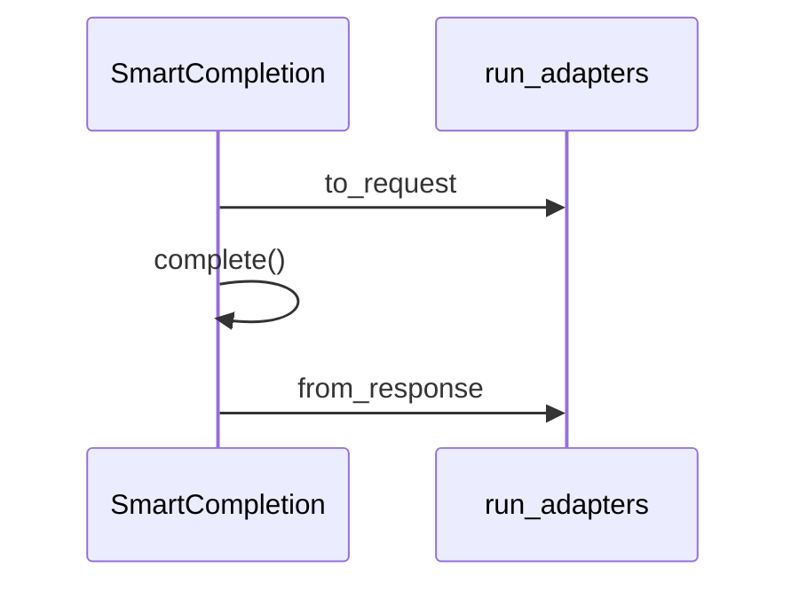

### SmartCompletions (Collection)

**Purpose**  
Manages a collection of items representing single request/response cycles: **SmartCompletion** objects.

**Key Points**
- Extends `Collection` from `smart-collections`.
- Defines a `new_completion(data = {})` method that:
		- Requires at least `data.user`.
		- Creates a minimal OpenAI-style request (`{ model, messages }`).
		- Invokes `create_or_update({ completion: { request }, ... })`.
		- Returns the new or updated **SmartCompletion** item.
- Lazy-initializes a shared `chat_model` instance (from environment).
		- If an item has local overrides (`data.completion.chat_model`), that item can build its own dedicated model instance instead of using the shared one.
- Merges the underlying chat model's `settings_config` into its own `get settings_config` for unified UI.

**Adapters**

- Exposes `get completion_adapters()` returning an array of adapter classes that will run on each **SmartCompletion** item before calling the model. By default, includes `[SmartCompletionContextAdapter]`, but you can append more in your own environment code.

```js
get completion_adapters() {
	return [
		// For example, the context adapter is included by default:
		SmartCompletionContextAdapter
		// You can add additional adapters here:
		// SmartCompletionDefaultAdapter, SmartCompletionTemplateAdapter, ThreadCompletionAdapter, ...
	];
}
```

---

### SmartCompletion (CollectionItem)

**Purpose**  
Represents a single completion request/response pair. Stores the initial request payload, final response, plus optional local `chat_model` overrides.

**Data Structure**

```js
{
	// standard item keys...
	data: {
		completion: {
			request: { ...OpenAI-like request... },
			response: { /* includes timestamp, choices, etc. */ },
			chat_model: {
				// optional local override: {platform: "openai", openai: {model_key: "gpt-3.5-turbo"}}
			}
		},
		// other data.* as needed
	}
}
```

**Key Methods**

1. **`init()`**  
Basic initialization logic (often empty).
2. **`build_request()`**
Utilizes `run_adapters()` to inspect each key in `item.data` and invoke `to_request()` on matching adapters before sending to the model.
3. **`get_chat_model()`**
	- If `data.completion.chat_model` is present with a valid `platform` and `model_key`, dynamically create a dedicated chat model instance.
	- Otherwise, return the parent collection’s shared `chat_model`.
4. **`complete()`**
	- Builds the request via `build_request()`.
	- Gets or creates a chat model.
	- Calls `chat_model.complete(requestPayload)` to get the model’s response.
	- Runs `run_adapters()` with `from_response` to parse data from the response.
	- Stores the response in `data.completion.response` (including a `timestamp`).
	- Queues a save of the item.
5. **`get response_text()`**
Returns a best-effort extracted text from `data.completion.response` (handles typical OpenAI-like `choices[0].message.content` or `.text`).
		

---

### Data Structures

1. **`item.data.key`**  
		Usually the unique key for the completion item. May be a hash or user-defined.
2. **`data.completion.request`**  
		The request object in OpenAI (or similar) format, e.g.
		
		```js
		{
			model: "gpt-3.5-turbo",
			messages: [
				{ role: "user", content: "Hello!" }
			],
			// other params...
		}
		```
		
3. **`data.completion.response`**  
		The last response from the chat model, e.g.
		
		```js
		{
			timestamp: 1678901234567,
			choices: [ { message: { role: "assistant", content: "Hi there!" } } ],
			usage: { ... },
			// ...
		}
		```
		
4. **`data.completion.chat_model`**  
		Optional overrides for platform/model. If present, item uses it to build a specialized chat model instead of the collection’s default.

---

### Collection-Level Settings

Because `SmartCompletions` often orchestrates a single chat model for all items, it merges those model’s settings into its own `settings_config`. This allows you to configure both:

- **SmartCompletions**-level settings (like default `model`, etc.).
- **Chat model**-specific credentials and parameters.

---

### Adapters Overview

Each adapter is a small class extending `SmartCompletionAdapter`.
`run_adapters()` inspects `item.data` and executes adapter hooks:

1. `to_request()`

							 - Reads from `item.data` to manipulate `item.data.completion.request`.
2. `from_response()` (optional)

							 - Reads the raw response from `item.data.completion.response` after `complete()` to do additional processing or cleanup.

**Default Adapters**

1. **`SmartCompletionDefaultAdapter`**
		
		- Checks `item.data.user`
		- Appends a user message to `request.messages[]`.
2. **`SmartCompletionContextAdapter`**
		
		- Checks `item.data.context` or `context_items` referencing a `SmartContext`.
		- Gathers ephemeral text from `context.get_snapshot()`
		- Inserts it as a system message or merges it into `request.messages[]`.
3. **`SmartCompletionTemplateAdapter`**
		
		- Checks `item.data.template` referencing a `SmartTemplate` item.
		- May add `tools` or `tool_choice` to `request.params`.
4. **`ThreadCompletionAdapter`**

		- Checks `item.data.thread` referencing a `smart_threads` item.
		- Appends each thread message into `request.messages[]`.
5. **`ActionCompletionAdapter`**

		- Checks `item.data.action_key` for a single `SmartAction` key.
		- Inserts the corresponding action tool via `insert_tools()` before the request.
		- After completion, parses the `tool_call` and calls `action_item.run_action()`.
								- Stores the result in `data.actions[action_key]` and updates the assistant message when `result.final` is present.
6. **`SmartCompletionVariableAdapter`**

								- Replaces variables like `{{folder_tree}}`, `{{folders_top}}`, `{{tags}}` and `{{recent_N}}` in all request messages.
								- Built‑in replacements are registered from the Obsidian Smart Environment.
								- Register custom variables via `SmartCompletionVariableAdapter.register(matcher, replacer)`.



In practice, you can chain multiple adapters by listing them in `SmartCompletions.completion_adapters`.

---

### Example Flow

1. **Create or update an item** via `new_completion({ user: "Hello AI" })`.
		
		- Minimally sets `request.model`, `request.messages[0]={role:"user", content:"Hello AI"}`.
2. The user or code sets additional properties, e.g. `item.data.thread="threadKey"`.
		
3. `item.complete()` is called.
		
		- `run_completion_adapters()` iterates each adapter:
				1. `SmartCompletionDefaultAdapter` sees `data.user` → adds a user message.
				2. `ThreadCompletionAdapter` sees `threadKey` → fetches messages, appends them.
				3. … etc.
		- After all adapters finish, `item` calls `chat_model.complete(item.data.completion.request)`.
		- The model returns a response, stored in `data.completion.response`.
4. You can read `item.response_text` to get the final assistant message.
		