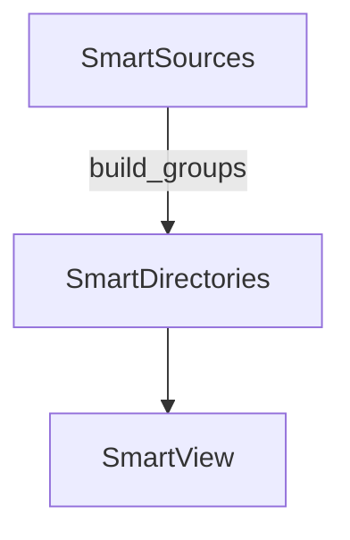

# Smart Directories

Organizes and tracks embedded directories derived from Smart Sources. Built on top of `smart-groups`, it maintains metadata and rendering hooks so environments can navigate file trees with vector awareness.

## Quick Start
```js
import { SmartEnv } from 'smart-environment';
import { SmartDirectories } from 'smart-directories';

const env = await SmartEnv.create({ smart_directories: SmartDirectories }, {
	modules: {
		// smart_fs and smart_sources must be configured
	}
});

// ensure directory hierarchy exists
await env.smart_directories.ensure_parent_directories('notes/2024/january.md');
```

## Key APIs
- `ensure_directory(path)` – create or retrieve a directory node for the given path
- `ensure_parent_directories(path)` – recursively build all parent directories
- `update_directory_metadata(path)` – refresh stats and vectors when sources change
- `render_directories(container, opts)` – render the directory tree via Smart View

## Usage Example
```js
import { SmartEnv } from 'smart-environment';
import { SmartDirectories } from 'smart-directories';

const env = await SmartEnv.create({ smart_directories: SmartDirectories }, {
	modules: {
		// configure smart_fs and smart_sources adapters
	}
});

await env.smart_sources.load_all();
await env.smart_directories.init();
const tree = await env.smart_directories.render_directories();
```

## Architecture


## Further Reading
- [Spec](./spec.md)
- [Tests](./test)
