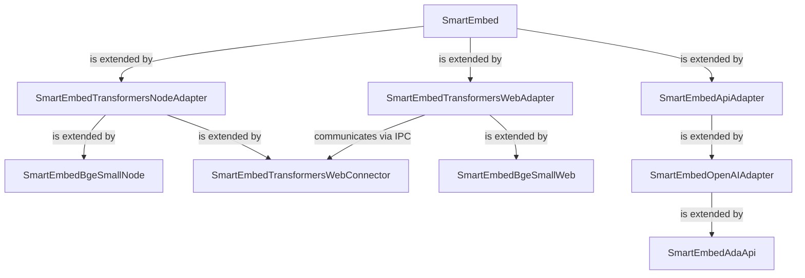

# Smart Embed
Smart Embed is a library that provides a standardized interface for embedding content. It supports various local and remote embedding models, making it a versatile tool for your development needs.



## install
```bash
npm install smart-embed
```

## usage

### `embed(input)`

Generates an embedding for a single input string.

#### Parameters

- `input` (String): The input text for which the embedding will be generated.

#### Returns

- (Object): An object containing:
    - `vec` (Array): The embedding vector for the input.
    - `tokens` (Number): The count of tokens used for the input.

#### Description

The `embed` method processes a single input string to obtain its embedding. It sends the input to an external service (such as OpenAI's API) and receives an embedding vector in response. The method returns an object containing the embedding vector and the total number of tokens used in the embedding process. This method is ideal for applications where individual text processing is required.

### `embed_batch(items)`

Processes a batch of inputs to generate embeddings for each.

#### Parameters

- `items` (Array): An array of objects, each containing an `embed_input` property with the input text.

#### Returns

- (Array): An array of updated items, each including:
    - `vec` (Array): The embedding vector.
    - `tokens` (Number): The proportional count of tokens used for the input.

#### Description

The `embed_batch` method is designed for batch processing multiple text inputs. It accepts an array of items and processes them simultaneously to generate embeddings. Each item in the input array is updated with its respective embedding vector and a proportionally calculated token count, based on the length of its input text. This method is particularly useful in scenarios where efficiency is key and multiple texts need to be processed in parallel.

## about
Designed for use with [Smart Collections](https://github.com/brianpetro/smart-collections) library and the [Smart Connections](https://smartconnections.app) Obsidian plugin.


## development
- `node build_web.js` is used to compile the web connector for loading via the web adapter.