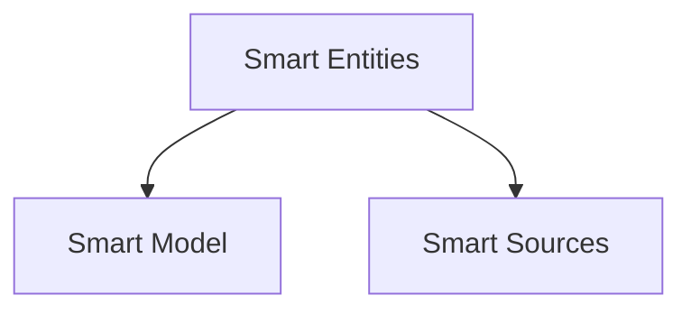

# Smart Entities

Smart Entities is a powerful module that provides classes for managing content with embeddings. It was originally designed for use with markdown files in the [Smart Connections](https://github.com/brianpetro/obsidian-smart-connections) Obsidian plugin, but it's easily extendable to other file types and use cases.

## Installation

To install Smart Entities, use npm:

```bash
npm install smart-entities
```

## Key Features

- Manage collections of entities with embeddings
- Efficient nearest neighbor search
- Support for multiple embedding models
- Extensible for various content types

## Core Classes

### SmartEntities

The base class for managing collections of smart entities. It provides methods for:
- loading the entities from storage 
- saving the entities to storage
- embedding the entities using a language model
- performing nearest neighbor searches

### SmartEntity

The base class representing an individual smart entity. It provides properties and methods for managing the entity's data, including:
- the entity's file path
- the entity's embedding vector 
- the number of tokens in the entity's content

#### `should_embed` vs `is_unembedded`

`should_embed` is a property that indicates whether the entity should be embedded based on the current settings (exclusions, etc.)

`is_unembedded` is a property that indicates whether the entity has not been embedded yet.

### EntityVectorAdapter

A utility class that provides a standardized interface for working with entity data, particularly embeddings.

## Usage

Here's a basic example of how to use Smart Entities:

```javascript
import { SmartEntities, SmartEntity } from 'smart-entities';

// Initialize SmartEntities
const smartEntities = new SmartEntities(environment, options);

// Create a new entity
const entity = new SmartEntity(environment, {
	path: 'path/to/file.md',
	content: 'This is the content of the entity.'
});

// Add the entity to the collection
await smartEntities.create_or_update(entity);

// Find nearest neighbors
const nearestNeighbors = await smartEntities.nearest(entity.vec);

// Perform a lookup based on hypotheticals
const results = await smartEntities.lookup({
	hypotheticals: ['What is the meaning of life?']
});
```

## Advanced Features

### Embedding Queue

Smart Entities includes an embedding queue system that allows for efficient batch processing of entities that need to be embedded. Use the `process_embed_queue()` method to start processing the queue.

### Multiple Embedding Models

The system supports using multiple embedding models. Each entity can have embeddings from different models, and you can switch between them as needed.

### Customizable Filtering

When performing nearest neighbor searches or lookups, you can apply custom filters to refine the results based on your specific needs.

## Extending Smart Entities

You can extend the `SmartEntity` and `SmartEntities` classes to add custom functionality for specific types of content or use cases. For example, you might create a `SmartNote` class that extends `SmartEntity` with additional methods for working with markdown notes.

## Architecture

Entities couple model capabilities with their originating sources.
