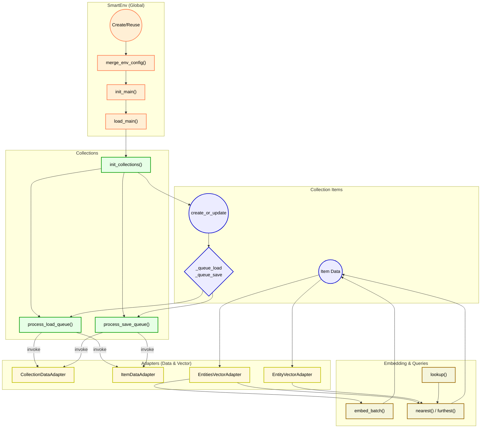

### api_spec.md

Location: at the root of the smart-entities folder.

Focuses on the public methods of `SmartEntities` (the collection) and `SmartEntity` (the item), referencing the inline JSDoc in `smart_entities.js` and `smart_entity.js`.


#### Purpose

- Show conceptual usage for the entity-based methods, especially embedding or vector queries.
- Reference JSDoc for specifics of parameters.


#### Public Methods Overview (SmartEntities)

1. `async nearest(vec, filter={})`  
    See JSDoc in `SmartEntities.nearest`.
    
    - Usage Notes:
        - Delegates to `entities_vector_adapter.nearest(vec, filter)`.
        - Returns items sorted by descending similarity.
    - Side Effects:
        - May read item vectors from memory or from an external store.
2. `async furthest(vec, filter={})`  
    See JSDoc in `SmartEntities.furthest`.
    
    - Usage Notes:
        - Delegates to `entities_vector_adapter.furthest(vec, filter)`.
    - Side Effects:
        - Similar to `nearest`, but sorts ascending by similarity.
3. `async lookup(params={})`  
    See JSDoc in `SmartEntities.lookup`.
    
    - Usage Notes:
        - Embeds a “hypothetical” text query (e.g., a user question) via the `embed_model`, then finds nearest items.
    - Side Effects:
        - Calls `this.embed_model.embed_batch` behind the scenes.
4. `async process_embed_queue()`  
    See JSDoc in `SmartEntities.process_embed_queue`.
    
    - Usage Notes:
        - Invokes the `entities_vector_adapter.process_embed_queue` for items flagged `_queue_embed`.
    - Side Effects:
        - Potentially large embedding calls to external or local ML models.


#### Public Methods Overview (SmartEntity)

1. `async nearest(filter={})`  
    See JSDoc in `SmartEntity.nearest`.
    
    - Usage Notes:
        - Returns neighbors to this item’s `vec`, using `this.collection.nearest_to`.
    - Side Effects:
        - None beyond read access to item vectors.
2. `async find_connections(params={})`  
    See JSDoc in `SmartEntity.find_connections`.
    
    - Usage Notes:
        - A convenience method that calls `nearest` with optional filters, caching results.
3. `async get_embed_input(content=null)`  
    See JSDoc in `SmartEntity.get_embed_input`.
    
    - Usage Notes:
        - Called before embedding. By default, a no-op that child classes override to populate `.embed_input`.
4. `set vec()` / `get vec()`  
    See JSDoc in `SmartEntity.vec`.
    
    - Usage Notes:
        - Mirrors the vector in `item.data.embeddings[modelKey]`.
    - Side Effects:
        - Setting `vec` unsets `_queue_embed` and queues a save.


### data_spec.md

Location: at the root of the smart-entities folder.

Describes the shape of `SmartEntity` data, especially embeddings (`entity.data.embeddings[...]`) and how entity metadata is stored.


#### Purpose

- Show how a single entity’s `.data` is structured, particularly embeddings.
- Note domain-specific rules about storing and discarding vectors from old or inactive models.


#### Entity Data Model

- `SmartEntity.data`  
    Typically looks like:
    
    ```js
    {
      path: "string",            // The file/path or ID for this entity
      embeddings: {              // Where vector data for different models is stored
        "model_key": {
          vec: [0.12, 0.75, ...], // The vector
          last_embed: {           // Additional metadata about the last embedding
            hash: "string",       // e.g. a content hash
            tokens: 123
          },
          error: "string"         // If an error was encountered during embedding
        },
        // Possibly other model_keys
      },
      // Additional domain-specific fields
    }
    ```
    
- `_queue_embed` (non-persistent)
    
    - A Boolean indicating that the item should be embedded by `SmartEntities`.
- `embed_input` (transient, not always stored in `.data`)
    
    - The textual input used when generating an embedding.


#### Data Flows

1. Reading
    
    - Entities may read their content from external sources (files, notes) to populate `embed_input`.
2. Embedding
    
    - `process_embed_queue()` uses `embed_input` to generate or update `data.embeddings[modelKey].vec`.
3. Model Switching
    
    - If the environment changes the active `embed_model_key`, old embeddings might be removed.
4. Deletion
    
    - If the entity is removed, the adapter may mark or remove its vector data.
    - Some systems simply delete `.data.embeddings` for that item.


### adapters/adapter_spec.md

Location: inside the `smart-entities/adapters/` directory.

Defines how the vector adapters (e.g. `EntitiesVectorAdapter` and `EntityVectorAdapter`) integrate. References the JSDoc in `adapters/_adapter.js` and any default adapters.


#### Purpose

- Describe the role of `EntitiesVectorAdapter` and `EntityVectorAdapter` in storing or retrieving embeddings.
- Summarize the usage of near/far queries.


#### Adapter Interfaces

1. `EntitiesVectorAdapter`  
    See JSDoc in `adapters/_adapter.js` for param details.
    - Abstract base for:
        - `nearest(vec, filter)`
        - `furthest(vec, filter)`
        - `embed_batch(entities)`
        - `process_embed_queue()`
2. `EntityVectorAdapter`  
    See JSDoc in `adapters/_adapter.js`.
    - Abstract base for:
        - `get_vec()`
        - `set_vec(vec)`
        - `delete_vec()`


#### Default Implementation

- `DefaultEntitiesVectorAdapter` / `DefaultEntityVectorAdapter`
    - See JSDoc in `adapters/default.js`.
    - Stores vectors in `item.data.embeddings[model_key].vec`.
    - Provides in-memory nearest/furthest by computing cosine similarity (`cos_sim`).
    - Embeds items in batches through `collection.embed_model`.


#### Data Flow Assumptions

- Embedding
    - The adapter calls `item.get_embed_input()` for each item to be embedded.
    - Then `embed_model.embed_batch` is used to generate vectors.
- Performance
    - Typically uses a chunked approach, e.g., processing items in sets of 50 or 100 at once.
- Nearest/Furthest
    - Filter out items that have no vector.
    - Return results sorted by similarity in descending (nearest) or ascending (furthest) order.

### diagram %% fold %%


