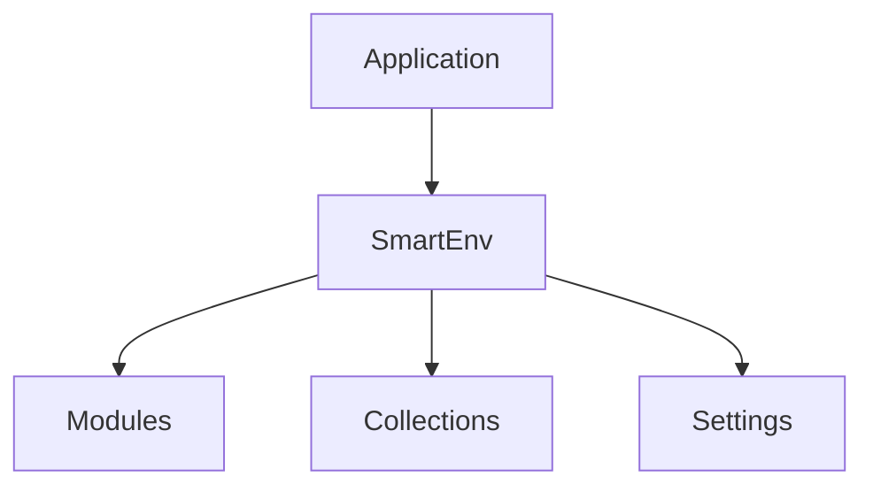

# Smart Environment

## Overview
Smart Environment orchestrates runtime configuration and coordinates Smart modules, providing a single context for collections, adapters, and settings.

## Quick Start
```js
import { SmartEnv } from 'smart-environment';

const main = {};
const env = await SmartEnv.create(main, {
	env_path: '/data',
	modules: {},
	collections: {}
});
```

## Key APIs
- `SmartEnv.create(main, opts)` – initialize or update the singleton environment
- `init_module(key, opts)` – register a module such as smart_fs or smart_view
- `render_settings(container)` – build settings UI for all modules and collections
- `to_json()` – return plain object of all collection item data

### Key Components of `smart_env_config`

- **`env_path`**: The base path for the environment, important for file system operations.
- **`collections`**: Defines the data collections managed by the environment.
	- Each collection should have:
		- **`class`**: The constructor function or class for the collection.
		- **`data_adapter`**: Adapter for handling data persistence.
		- **`item_types`**: Definitions of item classes within the collection.
- **`modules`**: Specifies additional functionalities or services.
	- Each module should have:
		- **`class`**: The constructor function or class for the module.
		- **`adapter`**: Adapter specific to the module's operation.
- **`default_settings`**: Default configuration settings that can be overridden by user preferences.
- **`components`**: UI components for rendering settings, views, and other interactive elements.

```js
export const smart_env_config = {
	
	// Base path for the environment
	env_path: '',
	
	// Collections to initialize
	collections: {
		smart_sources: {
			class: SmartSources,
			data_adapter: SmartCollectionMultiFileDataAdapter,
			// Collection-specific options...
		},
		// Other collections...
	},

	// Available item types
	item_types: {
		SmartSource,
		SmartBlock,
	},

	// Module configurations
	modules: {
		smart_fs: {
			class: SmartFs,
			adapter: SmartFsAdapter,
		},
		smart_view: {
			class: SmartView,
			adapter: ViewAdapter,
		},
		// Other modules...
	},

	// Default settings
	default_settings: {
		smart_sources: {
			file_exclusions: 'Untitled',
			folder_exclusions: 'smart-chats',
			excluded_headings: '',
		},
		// Other default settings...
	}
};
```


## Usage Example
```js
import { SmartEnv } from 'smart-environment';
import { SmartFs } from 'smart-fs';

const env = await SmartEnv.create({}, {
	env_path: '/tmp/app',
	modules: { smart_fs: { class: SmartFs } },
	collections: {}
});

await env.init_module('smart_fs');
```

## Architecture


## Further Reading
- [Spec](./spec.md)
- [Tests](./integration.test.js)
