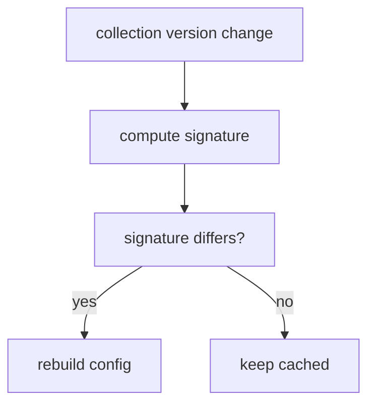

# smart-environment Specification

Exports from `index.js`:

| Export | Description |
| --- | --- |
| `SmartEnv` | Singleton class managing configuration, collections and modules. |

## Key Methods

| Method | Notes |
| --- | --- |
| `static create(main, opts)` | Adds main config and returns the singleton instance. |
| `static add_main(main, opts)` | Merges new main into the environment. |
| `static unload_main(main)` | Removes a main and its collections. |
| `wait_for({ main })` | Resolves when the env or main is ready. |
| `init_collections(config)` | Instantiates collection classes. |
| `load_collections(collections)` | Processes load queues for all collections. |
| `render_component(key, scope, opts)` | Renders a UI component via SmartView. |

## Data Flow

```mermaid
flowchart TD
	A[create()] --> B[add_main]
	B --> C[init_collections]
	C --> D[load_collections]
	D --> E[Environment ready]
```

### Version-aware config cache

`SmartEnv` maintains a cached `config` object which is automatically rebuilt
whenever any collection’s `static version` changes. The helper
`compute_collections_version_signature()` produces a pipe‑delimited string of
collection versions. When this signature differs from the cached one the config
is remerged. This prevents stale settings after hot reloading modules.



This file provides higher-level guidance on the public methods in `SmartEnv`. See the inline JSDoc within `smart_env.js` for details about parameters and return values.

#### Purpose
- Offer usage guidance for `SmartEnv` methods (e.g., how they relate to each other).
- Document side effects such as file system access or merges with environment config.
- Reference the method’s inline JSDoc instead of duplicating parameter or return-value definitions.

#### Public Methods Overview
1. `static async create(main, main_env_opts = {})`  
		See JSDoc in `SmartEnv.create` for parameter details.
		
		- Usage Notes:
				- Merges `main_env_opts` into an existing global `SmartEnv` instance (if any), or creates a new one.
				- Ensures only one environment instance is stored in the global namespace.
		- Side Effects:
				- May write or update environment options in `this.opts`.
				- Attaches a `SmartEnv` instance to the `main` object and to a global reference.
2. `async init(main, main_env_opts = {})`  
		See JSDoc in `SmartEnv.init` for parameter details.
		
		- Usage Notes:
				- Initializes the environment by merging options, loading files, and creating `SmartSettings`.
		- Side Effects:
				- Calls `fs.load_files()` to read from the file system.
				- Sets up environment references in `main`.
3. `init_main(main, main_env_opts = {})`  
		See JSDoc in `SmartEnv.init_main` for parameter details.
		
		- Usage Notes:
				- Adds a "main" object to the environment, merging its configuration.
		- Side Effects:
				- Updates `this.mains` array and attaches `this[main_key] = main`.
4. `async load_main(main_key, main_env_opts)`  
		See JSDoc in `SmartEnv.load_main` for parameter details.
		
		- Usage Notes:
				- Triggers collection initialization and loading for the specified main.
		- Side Effects:
				- Reads from and potentially writes to storage, depending on the collection’s adapters.
5. `unload_main(main_key, unload_config=null)`  
		See JSDoc in `SmartEnv.unload_main` for parameter details.
		
		- Usage Notes:
				- Removes a previously initialized main from the environment.
		- Side Effects:
				- Sets environment references to `null`, prunes `this.opts` to remove properties unique to that main, and possibly unloads any associated data from memory.
6. `merge_env_config(opts)`  
		See JSDoc in `SmartEnv.merge_env_config` for parameter details.
		
		- Usage Notes:
				- Performs a deep merge of environment options without overwriting existing nested properties.
		- Side Effects:
				- Mutates `this.opts`.
7. `async render_settings(container)`  
		See JSDoc in `SmartEnv.render_settings` for parameter details.
		
		- Usage Notes:
				- Renders environment-wide settings UI into the provided DOM container.
		- Side Effects:
				- Uses the environment’s `smart_view` module to manipulate the DOM.
8. `async load_settings()`  
		See JSDoc in `SmartEnv.load_settings` for parameter details.
		
		- Usage Notes:
				- Loads environment-level settings from the data file (e.g., `smart_env.json`).
		- Side Effects:
				- File I/O via `this.data_fs.read`.
9. `async save_settings(settings)`
		See JSDoc in `SmartEnv.save_settings` for parameter details.
		
		- Usage Notes:
				- Saves environment-level settings to disk (e.g., `smart_env.json`).
		- Side Effects:
				- Writes to `this.data_fs`.

10. `compute_collections_version_signature()`
		Generates a pipe-delimited string summarizing collection versions. Used to
		invalidate the cached `config` when modules hot reload.

11. `env_start_wait_time`
		Property returning the initial delay before `load()` is called. Defaults to
		`5000` but may be configured via `env_start_wait_time` in the merged config.


### data_spec.md

Location: at the root of the smart-environment folder.

This file describes how `SmartEnv` stores and manages its configuration data (`this.opts`, `main_env_opts`, merging of environment-level options), and any domain-specific rules about that data.


#### Purpose

- Capture the shape and usage of `SmartEnv`-related data structures (e.g., `env.opts`, `main_env_opts`, merges).
- Clarify domain-specific constraints or side effects not fully covered by JSDoc.


#### Overview of Data Flow

1. `main_env_opts`
		
		- Merged into `this.opts` when you call `SmartEnv.create(main, main_env_opts)`.
		- A typical shape includes:
				
				```js
				{
					env_path: "/path/to/env",
					collections: {
						// ...
					},
					modules: {
						// ...
					},
					item_types: {
						// ...
					},
					// ...
				}
				```
				
2. `this.opts`
		
		- At runtime, `this.opts` holds the merged configuration from all mains.
		- Deep merges do not overwrite existing sub-objects unless forced.
		- When `unload_main` is called, exclusive data from that main is removed.
3. Global Reference
		
		- `this.global_env` is attached to either `window` or `global` under a property (default `smart_env`).
		- Stores the single `SmartEnv` instance.
4. Settings Data (`smart_env.json`)
		
		- Stored in `this.data_fs_path` (defaults to `<env_path>/.smart-env` in many cases).
		- `load_settings` merges from file into in-memory defaults, so final `settings` is effectively:
				
				```
				final_settings = deep_merge(
					default_settings, 
					data_from_file, 
					opts.smart_env_settings
				);
				```
				
		- `save_settings` writes the final object as JSON.


#### Domain-Specific Constraints

- Naming Conventions: Mains are stored under `env[main_key]` where `main_key` is the snake_case version of the constructor name.
- Directory Paths:
		- `env_path` can be absolute or relative.
		- `env_data_dir` defaults to `.smart-env`, but the system detects existing `smart_env.json` files to confirm or override.


