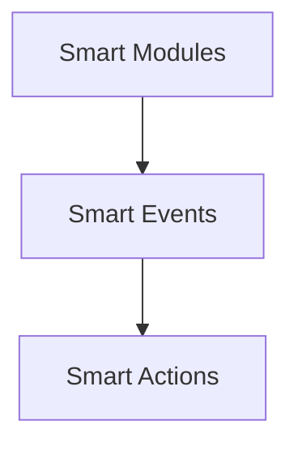

# Smart Events

## Overview
Coordinate asynchronous events across JSBrains modules.

## Architecture

Smart Events centralize event propagation, letting actions react to changes from any module.

## Features
- Appends an `at` timestamp when emitting.
- Freezes payload objects to keep handlers pure.
- Validates payloads are JSON‑safe (primitives or arrays of primitives).