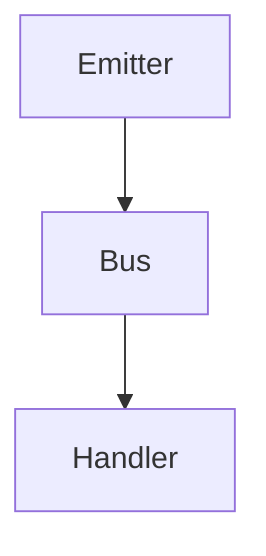

# Smart Events

Tiny, opinionated event bus for JSBrains modules.



## Usage

```js
import { SmartEvents } from 'smart-events';

const env = {};
SmartEvents.create(env);

env.events.on('user:logged_in', event => {
	console.log(event.id); // 1
});

env.events.emit('user:logged_in', { id: 1 });
```

Emitted payloads automatically gain an `at` timestamp and are frozen to keep handlers pure.
