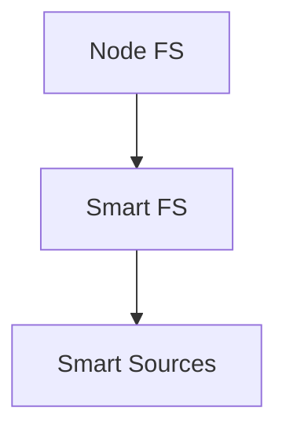

# Smart File System (SmartFs)

Smart FS is an intelligent file system wrapper designed for use with Smart Environments. It provides a layer of abstraction over various file system operations, adding features like automatic `.gitignore` handling, path resolution, and support for different adapters.

## Features

- Automatic `.gitignore` pattern handling
- Path resolution relative to the environment path
- Adapter-based architecture for flexible backend support (e.g., Node.js fs, Obsidian, etc.)
- Support for both synchronous and asynchronous operations
- Pre-processing and post-processing hooks for advanced file handling
- Comprehensive error handling and logging
- Fuzzy search capabilities for file paths

## Installation

```bash
npm install smart-file-system
```

## Usage

### Basic Usage

```js
import { SmartFs } from 'smart-file-system';
import { NodeFsSmartFsAdapter } from 'smart-file-system/adapters/node_fs.js';

const env = { config: { fs_path: '/path/to/your/project' } };
const smart_fs = new SmartFs(env, { adapter: NodeFsSmartFsAdapter });

// Initialize SmartFs
await smart_fs.init();

// Read a file
const content = await smart_fs.read('example.txt');
console.log(content);

// Write to a file
await smart_fs.write('output.txt', 'Hello, SmartFs!');

// List files in a directory
const files = await smart_fs.list('.');
console.log('Files in current directory:', files);
```

### Advanced Features

#### Fuzzy Search

SmartFs includes a fuzzy search capability for finding files:

```js
const search_result = smart_fs.get_link_target_path('partil_file_nme', 'source_file.md');
console.log('Fuzzy search result:', search_result);
```

#### Custom Ignore Patterns

You can add custom ignore patterns in addition to those from .gitignore:

```js
smart_fs.add_ignore_pattern('*.log');
smart_fs.add_ignore_pattern('temp_*');
```

## API Reference

### Core Methods

- `read(rel_path, encoding='utf-8')`: Read the contents of a file
- `write(rel_path, content)`: Write content to a file
- `append(rel_path, content)`: Append content to a file
- `remove(rel_path)`: Remove a file
- `exists(rel_path)`: Check if a file or directory exists
- `mkdir(rel_path, opts={})`: Create a new directory
- `remove_dir(rel_path, recursive=false)`: Remove a directory
- `rename(rel_path, new_rel_path)`: Rename a file or directory
- `stat(rel_path)`: Get file or directory statistics

### Listing Methods

- `list(rel_path='/')`: List contents of a directory
- `list_recursive(rel_path='/')`: List contents of a directory recursively
- `list_files(rel_path='/')`: List only files in a directory
- `list_files_recursive(rel_path='/')`: List only files in a directory recursively
- `list_folders(rel_path='/')`: List only folders in a directory
- `list_folders_recursive(rel_path='/')`: List only folders in a directory recursively

### Utility Methods

- `get_link_target_path(link_target, source_path)`: Perform fuzzy search for a file path
- `add_ignore_pattern(pattern, opts={})`: Add a custom ignore pattern
- `is_excluded(path)`: Check if a path is excluded based on ignore patterns


## Architecture

Smart FS wraps Node's file system to feed content into Smart Sources.
