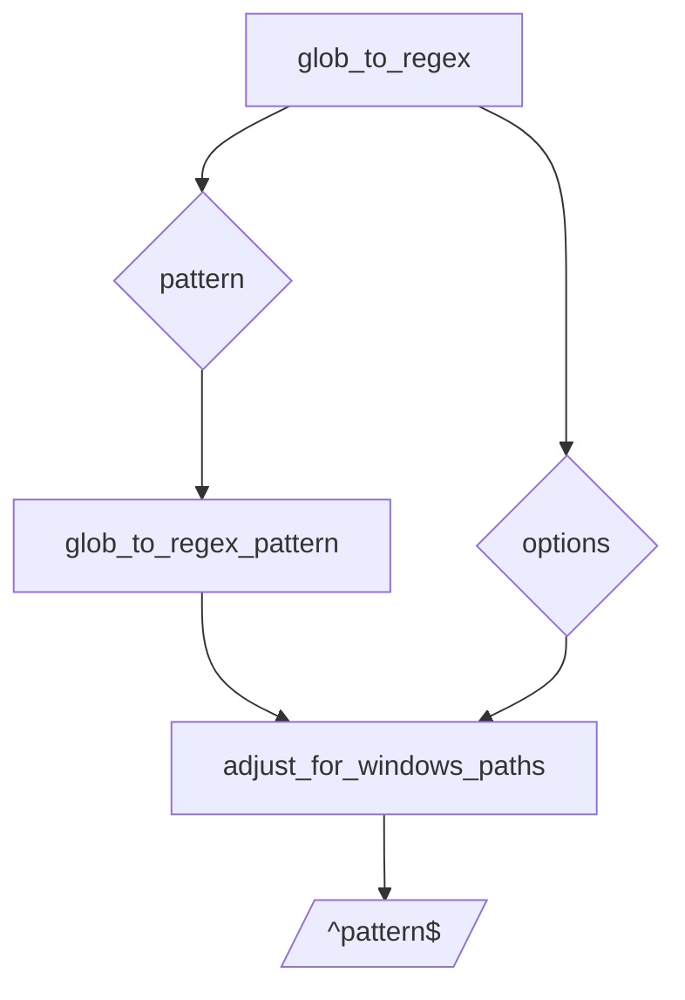

# smart-fs/utils Specification

Utility helpers for `SmartFs`.

| Function | Description |
| --- | --- |
| `glob_to_regex(pattern, options)` | Convert a glob pattern to a `RegExp` object. Supports extended globs and Windows paths. |
| `match_glob(pattern, str, options)` | Test if `str` matches a glob pattern. |
| `fuzzy_search(arr, search_term)` | Perform simple fuzzy search returning results ordered by closeness. |
| `is_text_file(file_path)` | Determine if a file path likely represents text. |
| `load_ignore_patterns_smart(smart_fs, start_dir, include_parents)` | Load ignore rules using `SmartFs` context. |
| `expand_pattern(line)` | Expand a gitignore-style line into glob patterns. |
| `should_ignore(relative_path, patterns, aggregator)` | Check if a path should be ignored based on patterns. |

## glob_to_regex Flow

