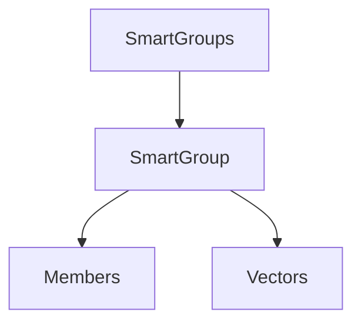

# Smart Groups

## Overview
Manage related items as groups and compute aggregate vectors for directory-level operations.

## Quick Start
```js
import { SmartGroups } from 'smart-groups';

const groups = new SmartGroups(env, { group_adapter });
await groups.init();
```

## Key APIs
- `SmartGroups` – collection managing multiple `SmartGroup` items
- `SmartGroup.members` – access items contained in the group
- `SmartGroup.get_nearest_members()` – find items closest to the group's vector
- `SmartGroup.update_stats()` – refresh directory statistics

## Usage Example
```js
import { SmartGroups } from 'smart-groups';

const groups = new SmartGroups(env, { group_adapter });
await groups.init();

const docs = groups.get('docs');
await docs.update_stats();
const nearest = await docs.get_nearest_members();
```

## Architecture


## Further Reading
- [Data Adapter](./adapters/data)
- [Vector Adapter](./adapters/vector)
- [Tests](./test)
