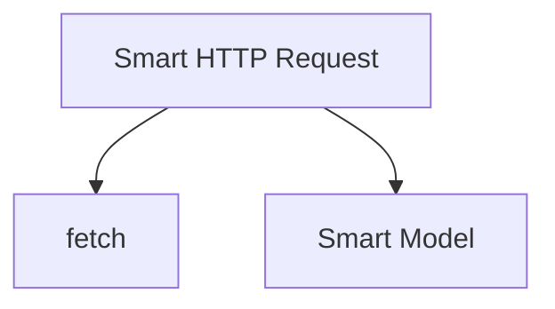

# Smart HTTP Request

## WHY
- Smart Environments have access to a variety of utilities for making HTTP requests.
- Allows for a single architecture to map to the available utility.

## WDLL (specs)
- Normalized requests for using a variety of HTTP adapters (node-fetch, obsidian, etc)
- Returns a normalized response object using the `SmartHttpResponse` class

## Usage
```js
import { SmartHttpRequest } from './smart_http_request.js';
const smart_http = new SmartHttpRequest();
// Making a GET request
const response = await smart_http.request({
	url: 'https://api.example.com/data',
	method: 'GET',
	headers: { 'Content-Type': 'application/json' }
});
console.log(await response.json());
// Making a POST request
const post_response = await smart_http.request({
	url: 'https://api.example.com/create',
	method: 'POST',
	headers: { 'Content-Type': 'application/json' },
	body: JSON.stringify({ key: 'value' })
});
console.log(await post_response.text());
```
## Architecture

HTTP requests wrap native fetch and route responses into models.
