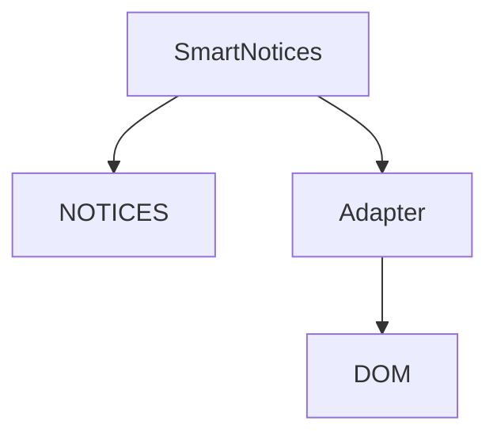

# Smart Notices

## Overview
Display user-facing notices with configurable text, buttons, and timeouts.

## Quick Start
```js
import { SmartNotices } from 'smart-notices';

const notices = new SmartNotices(env);
notices.show('load_env');
```

## Key APIs
- `show(id, opts)` – render a notice using a predefined or custom key
- `remove(id)` – hide an active notice
- `unload()` – clear all active notices

## Usage Example
```js
import { SmartNotices } from 'smart-notices';

const notices = new SmartNotices(env);
notices.show('copied_to_clipboard', { content: 'Hello' });
```

## Architecture


## Further Reading
- [Notice Definitions](./notices.js)
