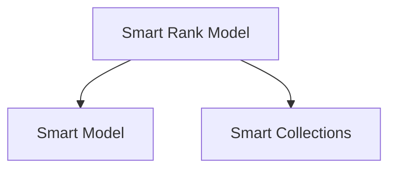

# smart-rank-model

`smart-rank-model` extends `smart-model` for ranking tasks. It supports multiple adapters (e.g., Cohere, transformers) to reorder documents based on a given query, providing a unified interface for switching backend models seamlessly.

## Features
- Extends `SmartModel` to handle ranking tasks.
- Provides a `rank(query, documents)` method, returning ranked results.
- Integrates adapters (API-based, local transformers, iframes, workers) to accommodate different runtime environments.
- Includes a curated `models.json` mapping adapter names to known model configurations.

## Folder Structure
```
smart-rank-model
├── adapters
│   ├── cohere.js              # Cohere API adapter
│   ├── transformers.js        # Local transformers adapter (Hugging Face)
│   ├── transformers_iframe.js # Transformers via iframe
│   ├── transformers_worker.js # Transformers via Web Worker
│   ├── _adapter.js            # Base ranking adapter
│   ├── _api.js                # Base API adapter class
│   └── _message.js            # Base message-based adapter class
├── connectors                 # Scripts used by iframe/worker adapters
├── build                      # Build scripts for connectors
├── test
│   ├── cohere.test.js
│   ├── transformers.test.js
│   └── _env.js
├── models.json                # Known model configurations
├── smart_rank_model.js        # Core SmartRankModel class
└── package.json
```

## Usage
```javascript
import { SmartRankModel } from 'smart-rank-model';
import { cohere as CohereAdapter } from 'smart-rank-model/adapters.js';

const rankModel = new SmartRankModel({
	model_key: 'cohere-rerank-english-v3.0',
	adapters: { cohere: CohereAdapter },
	model_config: { api_key: 'YOUR_COHERE_API_KEY', endpoint: "https://api.cohere.ai/v1/rerank" }
});
await rankModel.initialize();

const query = "What is the capital of the United States?";
const documents = [
	"Carson City is the capital city of Nevada.",
	"Washington, D.C. is the capital of the United States."
];
const results = await rankModel.rank(query, documents);
console.log(results);
```

## Switching Adapters
Change `model_key` and `adapter` to switch between Cohere, transformers, or other supported backends. `models.json` provides a quick lookup of supported models.

## Local Transformers
Use `transformers` adapter to run local ranking models via WebAssembly, WebGPU, or CPU fallback:
```javascript
import { transformers as TransformersAdapter } from 'smart-rank-model/adapters.js';

const localModel = new SmartRankModel({
	model_key: 'jinaai/jina-reranker-v1-tiny-en',
	adapters: { transformers: TransformersAdapter },
});
await localModel.initialize();
const response = await localModel.rank("organic skincare", ["Some doc", "Another doc"]);
```

## Testing
Run tests:
```
npm test
```

## License
MIT

## Architecture

The rank model scores collections using a base model before surfacing results.
