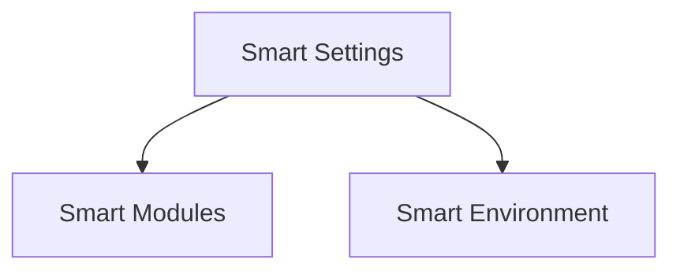

# Smart Settings

## Overview
Manage configuration shared across JSBrains modules.

## Architecture

Smart Settings provide centralized configuration feeding both the environment and individual modules.
