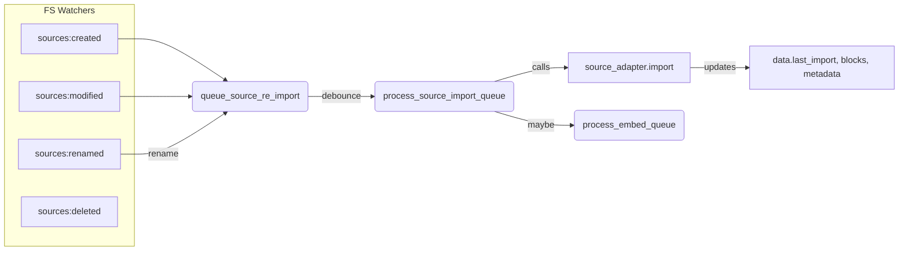
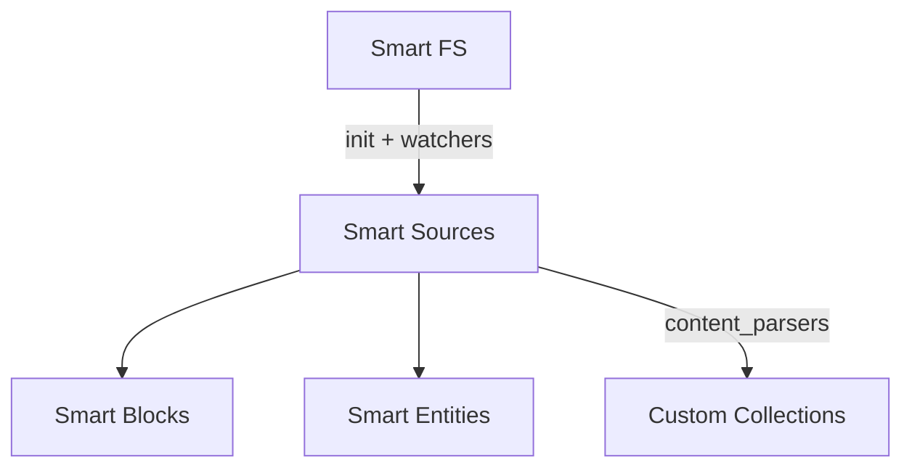

# Smart Sources

Smart Sources is a system for managing and parsing external content, typically stored in files or other data sources. Each content source is represented by a `SmartSource` entity, and these are collectively managed by a `SmartSources` collection. Internally, Smart Sources delegates reading, parsing, and writing to specialized adapters. You can define your own adapters for new file types or even external APIs.

Below is an outline of the architecture, configuration surface, and validation pathways that keep Smart Sources predictable across plugins.

## Quick reference

- **SmartSource**: represents an individual piece of external content. Handles import/read/write, block + link parsing, CRUD helpers (`read`, `update`, `append`, `remove`, `move_to`, `merge`, etc.), and integrates with block collections for sub-selection.
- **SmartSources**: collection coordinating all `SmartSource` items. Responsible for initialization, watching the file system, queueing imports, handling env events, building link maps, lookup/search APIs, and exposing settings surfaces.
- **SourceContentAdapter**: base class for reading/writing source data. Extend it for file-based or API-based adapters. Bundled adapters include:
	- `FileSourceContentAdapter` (parent for Markdown/Text, handles file I/O + hashing)
	- `MarkdownSourceContentAdapter` / `ObsidianMarkdownSourceContentAdapter`
	- `TextSourceContentAdapter`
	- `AjsonMultiFileSourceDataAdapter` (persists `.ajson` data alongside sources)

## Usage at a glance

1. **Environment and Collection Setup**  
	 Configure `env.opts.collections.smart_sources` with the required adapters:
	 ```
	 env.opts.collections.smart_sources = {
		 source_adapters: {
			 default: MarkdownSourceContentAdapter,
			 md: MarkdownSourceContentAdapter,
			 txt: TextSourceContentAdapter,
			 // additional custom types...
		 },
		 content_parsers: [
			 // optional array of parser functions called after parsing blocks
			 // e.g. parseTemplates, parseMermaid, etc.
		 ]
	 };
	 ```
	 Then create or retrieve your `SmartSources` collection instance.  
	 ```
	 const sources = env.smart_sources; // or new SmartSources(env, { ... })
	 ```

2. **Initialization**  
	 When you call:
	 ```
	 await sources.init_items();
	 ```
	 it discovers all potential items (files, or otherwise) and initializes them as `SmartSource` objects. File-based sources typically rely on the file system extension to pick an adapter. If no matching adapter is found, it falls back to `default`.

3. **Importing**  
	 Each `SmartSource` can be imported via:
	 ```
	 await source.import();
	 ```
	 The adapter reads raw data (e.g. from disk), then the source calls:
	 - `source.parse_content(content)` internally

4. **Reading & Writing**  
	 - **Read**:  
		 ```
		 const content = await source.read();
		 ```
	 - **Update** (writes the entire content):
		 ```
		 await source.update(newContent);
		 ```
	 - **Append** (adds lines at the end):
		 ```
		 await source.append('Extra lines');
		 ```
	 - **Remove** (deletes from file system and removes from the collection):
		 ```
		 await source.remove();
		 ```
		 or
		 ```
		 source.delete(); // removes from the collection data but doesn't always remove the file
		 ```

5. **Blocks**  
	 If the block collection is enabled (`env.smart_blocks`), `SmartSource` uses block-level parsing to identify sub-parts of each file. This helps with searching, partial merges, or line-based updates.  
	 For example, `parse_content(content)` may create references in `source.data.blocks` to each block range. You can then read or update individual blocks:
	 ```
	 const aBlock = env.smart_blocks.get('my_source.md#Heading 1');
	 await aBlock.append('some text');
	 ```

6. **Custom Content Parsers**  
	 To add specialized parsing after basic block/heading extraction, define custom parser functions in `env.opts.collections.smart_sources.content_parsers`. For example:
	 ```
	 env.opts.collections.smart_sources.content_parsers.push(
		 async function parseTemplates(source, content) {
			 // analyze 'content' and update source.data accordingly
			 // e.g. source.data.templates = ...
		 }
	 );
	 ```
	 When `source.parse_content(content)` runs, it calls each function in the array, passing `(source, content)`.

7. **init_items and Adapters**  
	 - `init_items()` is called in `SmartSources` to scan for relevant items (e.g. by file extension) and create or update `SmartSource` instances.  
	 - For file-based sources, the `FileSourceContentAdapter` (or its subclasses) helps detect changed files and triggers re-import.  
	 - You can override or define custom logic to handle items that are not stored on disk. (For external APIs, just implement a new adapter and list it in `source_adapters`.)

8. **Replacing Old 'source_adapter_key' Checks**  
	 Previously, the system relied on matching `source_adapter_key` for file types. Now, that logic is replaced by scanning `source_adapters` (e.g. `'md': MarkdownSourceContentAdapter`). If you need more dynamic detection:
	 - Build a custom map in `init_items` or
	 - Override `get source_adapter()` in `SmartSource` to detect type from the path or a custom property.

9. **Example snippet**  
	 ```
	 import { SmartSources } from 'smart-sources/smart_sources.js';

	 // Suppose env is your environment object
	 const sources = new SmartSources(env);
	 await sources.init_items();

	 // Create a new source
	 const newSource = await sources.create('notes/new_note.md', '# Title\nSome content');
	 await newSource.import(); // parse blocks, update data

	 // Read or update it
	 console.log(await newSource.read());
	 await newSource.update('# Title\nUpdated content!');
	 ```

## Data structures

`SmartSource.data` captures both on-disk metadata and Smart Env bookkeeping:

- `data.last_read { hash, mtime }` and `data.last_import { hash, mtime, size, at }` keep the adapter from re-importing unchanged sources.
- `data.blocks` mirrors Smart Blocks references. Missing blocks trigger `queue_import()` on init.
- `data.embeddings` is keyed by `embed_model_key` and only stores the active model vector.
- `data.metadata` is populated by adapters (e.g., Markdown frontmatter + tag set) so downstream consumers can query sources without reparsing.
- `data.outlinks` records outgoing links per source for later link map construction.

`SmartSources` tracks:

- `items { [path]: SmartSource }`
- `_fs.files` (registered paths) + `excluded_patterns` derived from `file_exclusions`, `folder_exclusions`, and `env_data_dir`.
- `sources_re_import_queue` to debounce repeated FS events.
- `_embed_queue` (mirrors `SmartEntities` queue) so blocks + sources embed asynchronously.

## Configuration

`env.opts.collections.smart_sources` controls adapters and hooks:

- `source_adapters`: map of adapter constructors. Each adapter can declare `static extensions = ['md', 'note.md']` so `SmartSources.get_extension_for_path()` can match the most specific multi-part extension (see `smart_sources.contract.test.js`).
- `content_parsers`: array of `(source, content) => Promise<void>` functions executed after the adapter’s `parse_content` method.
- `data_adapter`: persistence layer (AJSON multi-file by default) so collection data stays in sync with file system changes.
- `settings_config`: adapter-specific settings are merged into the collection’s settings UI by iterating all adapters and reading their `settings_config` definitions.

Environment modules must expose a Smart FS implementation (`env.opts.modules.smart_fs`). Smart Sources uses it to enumerate files, honor exclusion patterns, and emit `sources:*` events.

## Lifecycle & flow



- `init_items()` iterates every registered adapter and lets it enqueue file paths or remote sources.
- `init_file_path(path)` checks `fs.is_excluded(path)`, ensures the file is tracked, instantiates a `SmartSource`, and queues import/load. The new contract tests assert this behavior.
- `register_env_event_listeners()` listens for `sources:*` events emitted by file system adapters and funnels them into `queue_source_re_import()`.
- `process_source_import_queue()` batches imports, calls each adapter’s `import()` implementation, schedules embeddings, and raises notices for UX feedback.

## Core methods & actions

- `SmartSource.import()` delegates to `source_adapter.import()` and gracefully handles missing files (deleting stale items) or transient errors (re-queueing import).
- `SmartSource.parse_content()` is intentionally lightweight; custom logic should live in adapter `parse_content` or `content_parsers`.
- `SmartSource.get_embed_input()` trims excluded lines, prepends breadcrumbs (`folder > file`), and enforces token/char limits from the embed model.
- `SmartSource.get_block_by_line(line)` resolves a block by line range when block vectors exist.
- `SmartSources.create(key, content)` writes content via Smart FS, refreshes the FS cache, creates the entity, and immediately imports it.
- `SmartSources.search()` iterates items in batches (10 at a time) and composes lexical matches before sorting by frequency.
- `SmartSources.lookup(params)` merges source + block lookup results and respects `filter.limit` or `env.settings.lookup_k`.

## Adapters

| Adapter | Purpose | Notes |
| --- | --- | --- |
| `FileSourceContentAdapter` | Base class for any file-based adapter. | Handles load/save plumbing and exposes `can_import`, `outdated`, etc.
| `MarkdownSourceContentAdapter` | Imports `.md`/`.txt`, parses links, metadata, queues embeddings. | Calls `get_markdown_links`, `parse_frontmatter`, `get_markdown_tags`.
| `ObsidianMarkdownSourceContentAdapter` | Markdown adapter that reads from Obsidian’s metadata cache. | Keeps file parsing consistent with the app.
| `TextSourceContentAdapter` | Lightweight text import when markdown semantics aren’t required. | Still benefits from content parsers.
| `AjsonMultiFileSourcesDataAdapter` | Writes collection data to `.ajson` sidecar files. | Powers import/save queues and enables deterministic tests.

## Blocks, content parsers, and metadata

`SmartSource.parse_content(content)` executes after adapter parsing:

- optional block parsing (if `block_collection.import_source` is available)
- ensures `source.data.blocks` exists
- runs every function in `env.opts.collections.smart_sources.content_parsers`
- stores parser results on `source.data` (e.g., `templates`, `metadata`, `outlinks`)

You can customize this flow to:

- Identify frontmatter and tags (see `MarkdownSourceContentAdapter.get_metadata`)
- Extract domain-specific structures (templates, canvases, etc.)
- Build LLM-friendly summaries before embedding

## Initialization helpers

- `init_items()` orchestrates the first scan, raises notices (`initial_scan`), and delegates discovery to each adapter’s static `init_items(collection)` method.
- `get_extension_for_path(path)` splits the filename, tries multi-part extensions (e.g., `note.md` before `md`), and returns the first adapter-supported extension. Multi-part support is covered by `test/smart_sources.contract.test.js`.
- `register_source_watchers()` asks the Smart FS adapter to watch for future changes so `sources:*` events stay in sync with the OS.

Example override:
```
class CustomRemoteSources extends SmartSources {
	async init_items() {
		const remoteRecords = await someApiFetch();
		remoteRecords.forEach(record => {
			const key = `remote/${record.id}.json`;
			if (!this.items[key]) {
				const item = new this.item_type(this.env, { path: key, remote_id: record.id });
				this.items[key] = item;
			}
		});
	}
}
```

## Additional references

- **`smart_source.js`** — core entity methods (`import`, `read`, `update`, `append`, `remove`, `move_to`, `merge`, `get_embed_input`, `find_connections`).
- **`smart_sources.js`** — collection lifecycle (`init_items`, `register_env_event_listeners`, `queue_source_re_import`, `process_source_import_queue`, `build_links_map`, `lookup`, `search`, `settings_config`).
- **Adapters** — `adapters/markdown_source.js`, `adapters/text.js`, `adapters/data/ajson_multi_file.js`, etc. Extend these for new file types or API-backed sources.

These adapters show how you can customize read/write logic or handle specialized formats. By combining them with `env.opts.collections.smart_sources.content_parsers`, you can parse nearly any text-based content into structured data or blocks.

## Testing

- Run `npm test` inside `packages/jsbrains/smart-sources` to execute the full AVA suite. Some legacy suites depend on optional packages; review console output for missing peer dependencies.
- `test/smart_sources.contract.test.js` adds focused unit tests that assert multi-part extension detection and `init_file_path` queueing.
- Integration suites (`test/markdown_source.test.js`, `test/ajson_multi_file.test.js`, `test/sqlite.test.js`) validate adapters against generated fixture content.

## Architecture



Smart Sources layer file system access and feed blocks, embeddings, and downstream collections.
