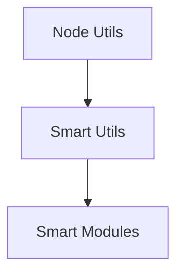

# Smart Utils

Dependency-free utilities for smart-env.

Includes helpers for working with nested object paths:

```
import { get_by_path, set_by_path, delete_by_path } from 'smart-utils';
```

## Architecture

Utility helpers extend native Node patterns for use across modules.
