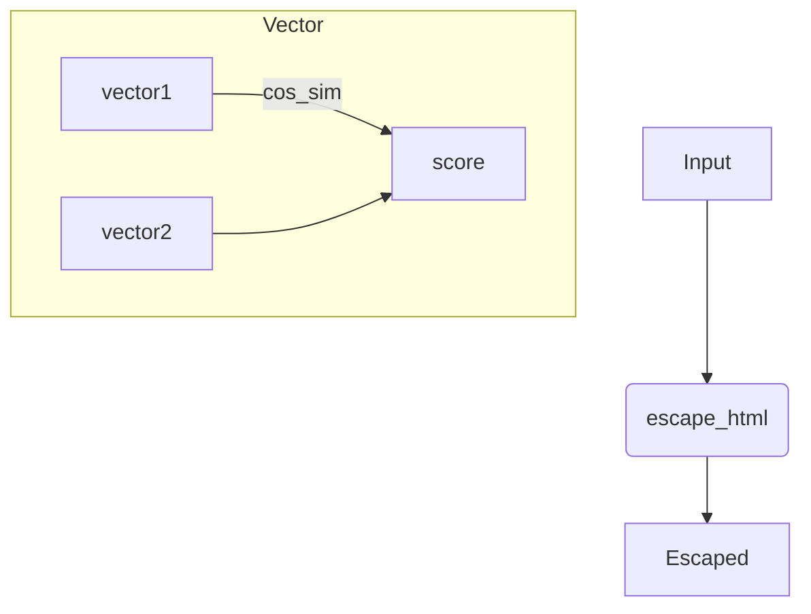
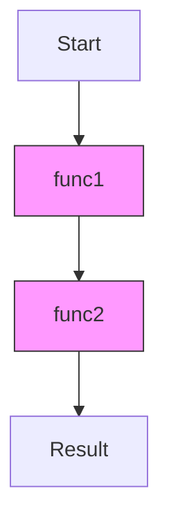

# smart-utils Specification

Utility functions with no dependencies. Exports:

| Function | Description |
| --- | --- |
| `create_hash(text)` | SHA-256 hash of input string. Input longer than 100000 chars is truncated. Returns hex string. |
| `murmur_hash_32(input_string, seed)` | 32-bit MurmurHash3. |
| `murmur_hash_32_alphanumeric(input_string, seed)` | MurmurHash3 result converted to base36. |
| `fnv1a_32(input_string)` | 32-bit FNV-1a hash. |
| `fnv1a_32_alphanumeric(input_string)` | FNV-1a result converted to base36. |
| `compute_centroid(points)` | Arithmetic mean of N-dimensional points. |
| `compute_medoid(points)` | Point with minimal sum of distances to others. |
| `escape_html(str)` | Escape HTML special characters. |
| `camel_case_to_snake_case(str)` | Convert CamelCase to snake_case. |
| `to_pascal_case(str)` | Convert strings with dashes, spaces or underscores to PascalCase. |
| `deep_merge(target, source)` | Deep merge plain objects. |
| `deep_merge_with_array_handling(target, source)` | Merge objects while concatenating arrays. |
| `cos_sim(vector1, vector2)` | Cosine similarity of two vectors. |
| `sleep(ms)` | Promise that resolves after given milliseconds. |
| `get_by_path(obj, path, scope?)` | Retrieve nested value. Returns bound function if value is callable. |
| `set_by_path(obj, path, value, scope?)` | Set nested value, creating objects as needed. |
| `delete_by_path(obj, path, scope?)` | Delete nested value if present. |
| `convert_to_human_readable_size(bytes)` | Convert bytes to a readable string like `2 MB`. |
| `convert_to_time_ago(date)` | Return relative time string like `3h ago`. |
| `sequential_async_processor(funcs, initial, opts?)` | Execute each async function in order, passing the previous result and `opts`. Throws if a list item is not callable. |
| `parse_xml_fragments(xml_input)` | Convert XML fragments to plain objects. |
| `build_file_tree_string(paths)` | Render an ASCII tree from a list of file paths. |

