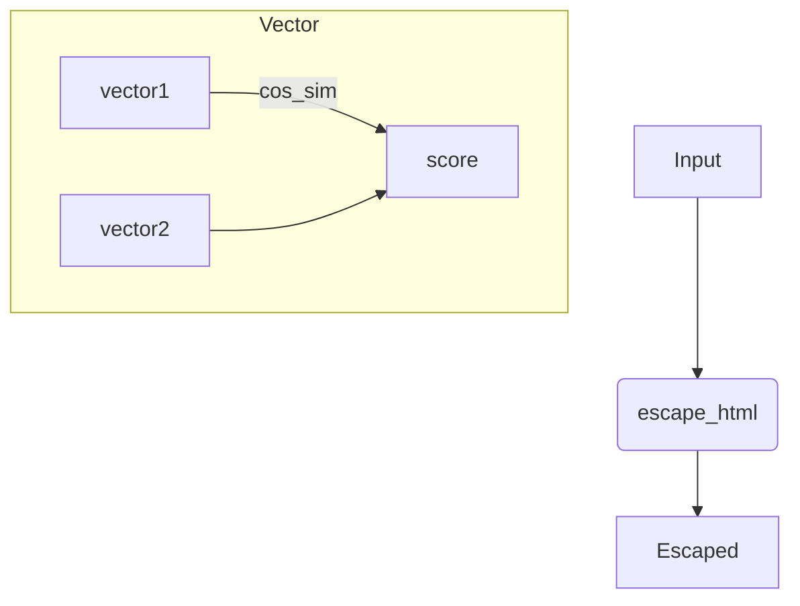

# smart-utils Specification

Utility functions with no dependencies. Exports:

| Function | Description |
| --- | --- |
| `create_hash(text)` | SHA-256 hash of input string. Input longer than 100000 chars is truncated. Returns hex string. |
| `murmur_hash_32(input_string, seed)` | 32-bit MurmurHash3. |
| `murmur_hash_32_alphanumeric(input_string, seed)` | MurmurHash3 result converted to base36. |
| `fnv1a_32(input_string)` | 32-bit FNV-1a hash. |
| `fnv1a_32_alphanumeric(input_string)` | FNV-1a result converted to base36. |
| `compute_centroid(points)` | Arithmetic mean of N-dimensional points. |
| `compute_medoid(points)` | Point with minimal sum of distances to others. |
| `escape_html(str)` | Escape HTML special characters. |
| `camel_case_to_snake_case(str)` | Convert CamelCase to snake_case. |
| `to_pascal_case(str)` | Convert strings with dashes, spaces or underscores to PascalCase. |
| `deep_merge(target, source)` | Deep merge plain objects. |
| `cos_sim(vector1, vector2)` | Cosine similarity of two vectors. |
| `sleep(ms)` | Promise that resolves after given milliseconds. |

