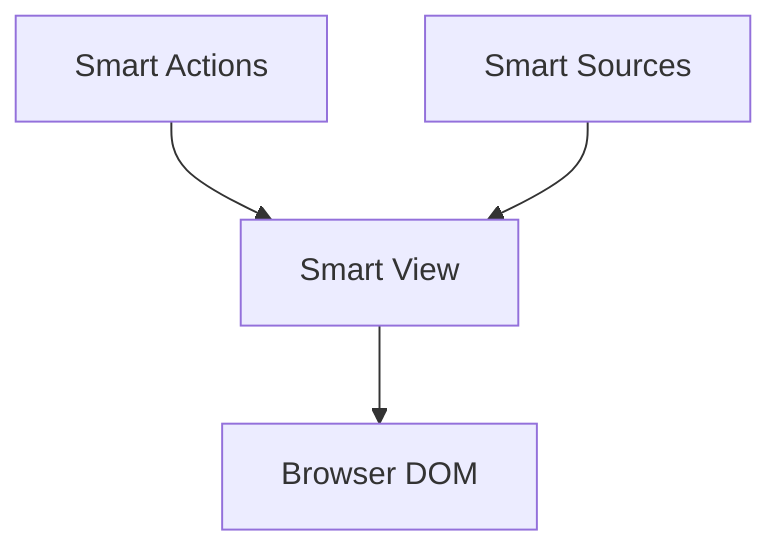

# Smart View

Smart View is a flexible and powerful library for rendering dynamic settings interfaces in JavaScript applications. It provides a consistent API for creating and managing settings across different environments, such as web browsers and Obsidian plugins.

## Features

- Render various types of setting components (text, dropdown, toggle, etc.)
- Support for custom adapters to work in different environments
- Dynamic rendering based on conditions
- Markdown rendering support
- Icon support
- Extensible architecture

## Installation

To install Smart View, use npm:

```bash
npm install smart-view
```

## Usage

### Basic Setup

First, import and initialize Smart View with an appropriate adapter:

```js
import { SmartView } from 'smart-view';
import { SmartViewNodeAdapter } from 'smart-view/adapters/node';

const smartView = new SmartView({
	adapter: SmartViewNodeAdapter
});
```

### Rendering Settings

Smart View uses a three-step process for rendering settings:

1. Build HTML for setting components
2. Render the component
3. Post-process the rendered component

#### Step 1: Build HTML

The `build_html` function generates the HTML string for a component:

```js
async function build_html(scope, opts = {}) {
	// Generate and return HTML string
	return html;
}
```

#### Step 2: Render

The `render` function builds the HTML and post-processes it:

```js
async function render(scope, opts = {}) {
	let html = await build_html.call(this, scope, opts);
	const frag = this.create_doc_fragment(html);
	return await post_process.call(this, scope, frag, opts);
}
```

#### Step 3: Post-process

The `post_process` function adds event listeners and performs other necessary operations:

```js
async function post_process(scope, frag, opts = {}) {
	// Add event listeners, perform additional operations
	return frag;
}
```

### Use of Document Fragments

Smart View utilizes document fragments for efficient DOM manipulation. A document fragment is a lightweight container for holding DOM nodes before they are inserted into the main document. This approach offers several benefits:

1. **Performance**: When you make changes to a document fragment, it doesn't cause reflow or repaint of the main document. This can significantly improve performance, especially when making multiple DOM changes.

2. **Atomic Updates**: All the changes made to a document fragment can be applied to the main document in a single operation, reducing the number of reflows and repaints.

3. **Memory Efficiency**: Document fragments exist in memory and not as part of the main DOM tree, making them more memory-efficient for temporary storage of DOM elements.

In Smart View, document fragments are created using the `create_doc_fragment` method:

```js
const frag = this.create_doc_fragment(html);
```

This fragment is then used in the `post_process` step, where event listeners and other modifications can be applied efficiently before the fragment is inserted into the main document.

#### Document Fragment Gotchas

While document fragments are powerful, there are some limitations to be aware of:

1. **No Access to Attributes**: The document fragment itself doesn't have access to attributes that are typically available on DOM elements.

2. **No Dataset Property**: The `dataset` property, which provides access to custom data attributes, is not available on the document fragment itself.

It's important to note that these limitations apply only to the outer-most document fragment container, not to the individual elements within the fragment. Elements inside the fragment retain all their normal properties and attributes. For example:

```js
const frag = this.create_doc_fragment('<div data-custom="value">Content</div>');

// This won't work (undefined):
console.log(frag.dataset.custom);

// But this will work:
const div = frag.querySelector('div');
console.log(div.dataset.custom); // Outputs: "value"
```

In Smart View, we handle these limitations by ensuring that operations that need to access attributes or dataset properties are performed on the individual elements within the fragment, rather than on the fragment itself. This allows us to take full advantage of the performance benefits of document fragments while still maintaining access to all necessary element properties.

### Creating Settings

You can create settings programmatically or directly in HTML:

Programmatically:
```js
const settingConfig = {
	setting: 'user.email',
	type: 'text',
	name: 'Email Address',
	description: 'Enter your email address'
};

const settingHtml = smartView.render_setting_html(settingConfig);
container.innerHTML += settingHtml;
await smartView.render_setting_components(container);
```

In HTML:
```html
<div class="setting-component" 
		 data-setting="user.name" 
		 data-type="text" 
		 data-name="User Name" 
		 data-description="Enter your full name">
</div>
```

Then render:
```js
const container = document.getElementById('settings-container');
await smartView.render_setting_components(container);
```

## API Reference

### SmartView Class

#### Constructor

- `new SmartView(options)`
	- `options.adapter`: The adapter class to use for rendering

#### Methods

- `render_setting_components(container, options)`: Renders all setting components within a container
- `render_setting_component(settingElement, options)`: Renders a single setting component
- `render_setting_html(settingConfig)`: Generates HTML for a setting component
- `get_by_path(obj, path)` / `set_by_path(obj, path, value)` /
	`delete_by_path(obj, path)` are re-exported from `smart-utils` for
	use across packages.
- `escape_html(str)`: Escapes HTML special characters in a string
- `add_toggle_listeners(fragment, callback)`: Adds toggle listeners to elements with data-toggle attribute
- `validate_setting(scope, opts, settingKey, settingConfig)`: Validates the setting config and determines if it should be rendered
- `create_doc_fragment(html)`: Creates a document fragment from an HTML string

### Adapters

Smart View uses adapters to work in different environments. Two built-in adapters are provided:

- `SmartViewNodeAdapter`: For use in Node.js environments
- `SmartViewObsidianAdapter`: For use in Obsidian plugins

You can create custom adapters by extending the `SmartViewAdapter` class and implementing the required methods.

## Setting Types

Smart View supports various setting types:

- `text`: Single-line text input
- `password`: Password input
- `number`: Numeric input
- `dropdown`: Dropdown select
- `toggle`: On/off toggle switch
- `textarea`: Multi-line text input
- `button`: Clickable button
- `folder`: Folder selection
- `text-file`: Text file selection
- `json`: Key-value pairs
- `array`: List of strings

### callbacks
```js
if (callback) callback(path, value, elm, scope);
```
- [ ] TODO: clarify the purpose and usage of the callback function.


## Custom Adapters

To create a custom adapter for a specific environment:

1. Create a new class that extends `SmartViewAdapter`
2. Implement the required methods (e.g., `get_icon_html`, `render_markdown`)
3. Pass your custom adapter to the SmartView constructor

Example:

```js
class MyCustomAdapter extends SmartViewAdapter {
	get_icon_html(icon_name) {
		// Custom implementation
	}

	async render_markdown(markdown, scope) {
		// Custom implementation
	}

	// Implement other required methods
}

const smartView = new SmartView({
	adapter: MyCustomAdapter
});
```

By following this pattern, you can easily extend SmartView to work in various environments while maintaining a consistent API for rendering settings.

## Component Rendering Pattern

Smart View uses a consistent pattern for rendering components:

1. `build_html`: Generates the HTML string for the component
2. `render`: Calls `build_html` and `post_process`
3. `post_process`: Adds listeners and performs final operations

This pattern, combined with the use of document fragments, allows for flexible, extensible, and efficient component rendering across different environments.

# Developer Guide: SmartView `render` Method-Export Pattern

Follow this clear, repeatable pattern when developing components for the SmartView ecosystem. This ensures consistency, modularity, and ease of integration.

## Component File Structure

Each component exports three functions:

- `build_html(scope, opts)` → Returns raw HTML as a string.
- `render(scope, opts)` → Converts HTML to a DOM fragment and post-processes it.
- `post_process(scope, frag, opts)` → Applies event listeners and final DOM adjustments.

## Implementation Details

### 1. `build_html(scope, opts)`

**Purpose:** Generates raw HTML markup based on input data.

```js
/**
 * Generate raw HTML markup.
 * @param {Object} scope - Data/config for component.
 * @param {Object} [opts={}] - Additional options.
 * @returns {string} HTML markup string.
 */
export function build_html(scope, opts = {}) {
	return `
		<div class="my-component">
			<button class="refresh-btn">Refresh</button>
			<p>${scope.text}</p>
		</div>
	`;
}
```

### 2. `render(scope, opts)`

**Purpose:** Transforms HTML to DOM fragment and initiates post-processing.

```js
/**
 * Render component to DocumentFragment.
 * @param {Object} scope - Data/config for rendering.
 * @param {Object} [opts={}] - Additional options.
 * @returns {Promise<DocumentFragment>} Rendered fragment.
 */
export async function render(scope, opts = {}) {
	const html = build_html.call(this, scope, opts);
	const frag = this.create_doc_fragment(html);
	return await post_process.call(this, scope, frag, opts);
}
```

### 3. `post_process(scope, frag, opts)`

**Purpose:** Adds event listeners, final DOM manipulations, and interaction logic.

Always preserve context using `const self = this;` for event listeners.

```js
/**
 * Attach listeners and perform DOM manipulation.
 * @param {Object} scope - Data/config.
 * @param {DocumentFragment} frag - Rendered fragment.
 * @param {Object} [opts={}] - Additional options.
 * @returns {Promise<DocumentFragment>} Fragment ready for DOM insertion.
 */
export async function post_process(scope, frag, opts = {}) {
	const self = this;

	const refresh_btn = frag.querySelector('.refresh-btn');
	refresh_btn.addEventListener('click', async () => {
		await self.re_render();
	});

	return frag;
}
```

## Key Guidelines

- Always clearly separate responsibilities:
	- HTML generation (`build_html`).
	- DOM construction (`render`).
	- Event handling and DOM updates (`post_process`).

- Explicitly pass `this` context using `.call(this, scope, opts)`.
- Always capture `this` as `const self = this;` in event listeners.
- Return promises from async methods (`render`, `post_process`).

Adhering to these guidelines ensures code maintainability, modularity, and ease of debugging across SmartView components.


## Architecture

Smart View renders data from sources and actions into the user interface.
